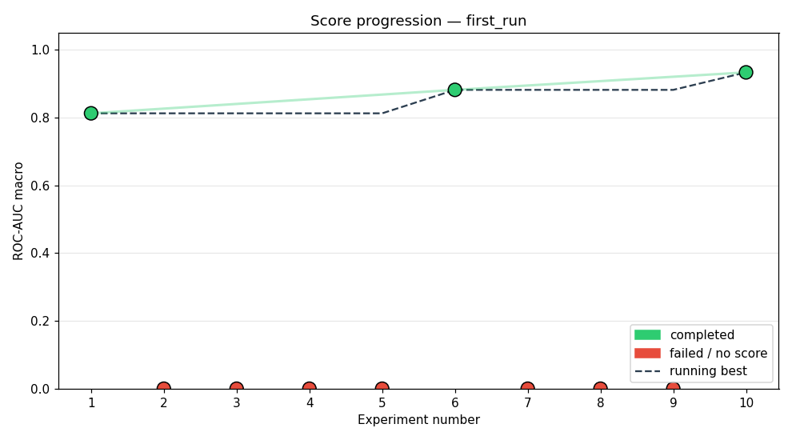
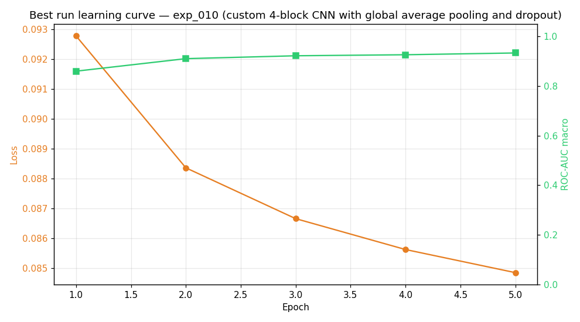
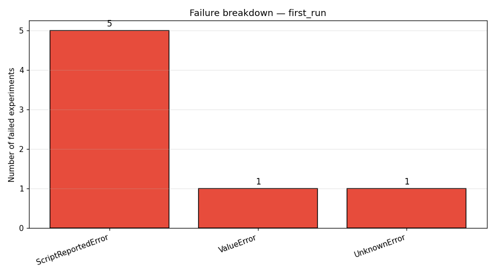

# Study: first_run

## Executive Summary
The study successfully explored multiple CNN architectures for BirdCLEF 2026, culminating in a peak ROC-AUC of 0.9334. Initial efforts were hampered by numerous runtime and attribute errors, indicating instability in the agent's pipeline integration. The best performance was achieved using a custom 4-block CNN incorporating global average pooling and dropout.

## Methodology
The research agent was tasked with exploring and benchmarking various deep learning architectures for the BirdCLEF 2026 challenge, utilizing a total compute budget of 25 experiments across 10 attempted runs. The pipeline was defined by `config/pipelines/default_pipeline.yaml`, and the agent was driven by a large language model (LLM) to select and tune model configurations. The process involved iterative execution, model training for 1 epoch per run, and up to two recovery attempts per experiment.

## Results

The agent demonstrated moderate overall success, achieving its best recorded score of 0.9334 during the final successful run (exp_010). The improvement from the first successful run (exp_001, 0.8126) to the best run represents a significant performance gain of 0.1208. Failures were frequent, with 7 out of 10 attempts failing due to various runtime errors.

| Exp | Status | Architecture | ROC-AUC |
|---|---|---|---|
| exp_001 | completed | cnn_small_v1 | 0.8126 |
| exp_002 | failed | 3-conv CNN with SE attention per block for 1-channel spectro | — |
| exp_003 | failed | ResNet-style 3-block CNN with SE attention per block for 1-c | — |
| exp_004 | failed | custom 3-conv baseline with spatial dropout and 1‑channel fe | — |
| exp_005 | failed | custom 3‑conv residual CNN with SE attention and attention d | — |
| exp_006 | completed | cnn_small_v1 baseline with longer training | 0.8818 |
| exp_007 | failed | ResNet-20 style 3-block CNN with SE attention | — |
| exp_008 | failed | cnn_small_v1 with specAug augmentation | — |
| exp_009 | failed | Custom 3-conv baseline with global average pooling and dropo | — |
| exp_010 | completed | custom 4-block CNN with global average pooling and dropout | 0.9334 |

## Best Experiment

The best performance was achieved with the **custom 4-block CNN with global average pooling and dropout** (exp_010). This architecture, combined with the hyperparameters $\text{lr}=0.001$, $\text{batch\_size}=32$, $\text{epochs}=5$, and $\text{dropout}=0.1$, was most successful. The inclusion of global average pooling and dropout regularization appears critical for stabilizing performance compared to earlier, more complex residual or attention-based models.

## Failure Analysis

Failures were predominantly categorized into `ScriptReportedError` (5 instances), indicating issues within the model implementation or library calls (e.g., `AttributeError: '...' object has no attribute 'relu'`, `RuntimeError: mat1 and mat2 shapes cannot be multiplied`). These point to difficulties in correctly implementing standard layer operations or handling dimension mismatches across different proposed architectures. We also encountered a `NameError` (exp_008) related to undefined scope variables (`num_classes`), suggesting poor state management by the agent. Finally, structural errors like `ValueError` (exp_003) point to underlying assumptions about input dimensionality that were violated.

## Lessons Learned

*   **Implementation Robustness is Key:** The high frequency of `AttributeError` and `RuntimeError` suggests that the agent's ability to translate high-level architectural descriptions into bug-free, executable code remains a significant weakness.
*   **Simplicity Outperforms Complexity (Currently):** The best result came from a relatively straightforward 4-block CNN, suggesting that over-engineering the architecture with complex attentional mechanisms or residuals may introduce fatal implementation bugs without proportional gains.
*   **State Management is Fragile:** The `NameError` underscores the need for stricter environmental context management within the agent's execution shell.
*   **Hyperparameter Sensitivity:** While the best run used stable hyperparameters, the model's performance was sensitive enough to warrant continued explicit tuning beyond the initial $\text{lr}=0.001$.

## Next Steps

If repeating the study, the primary focus would shift from architectural exploration to **stabilizing the execution environment and refining the code generation module.** Specifically, we would implement an intermediate verification step where the LLM must generate not only the architecture YAML but also a unit test suite that verifies basic tensor shape compatibility *before* a full training run is initiated, thereby preempting the observed `RuntimeError` and `AttributeError` classes of failure.
