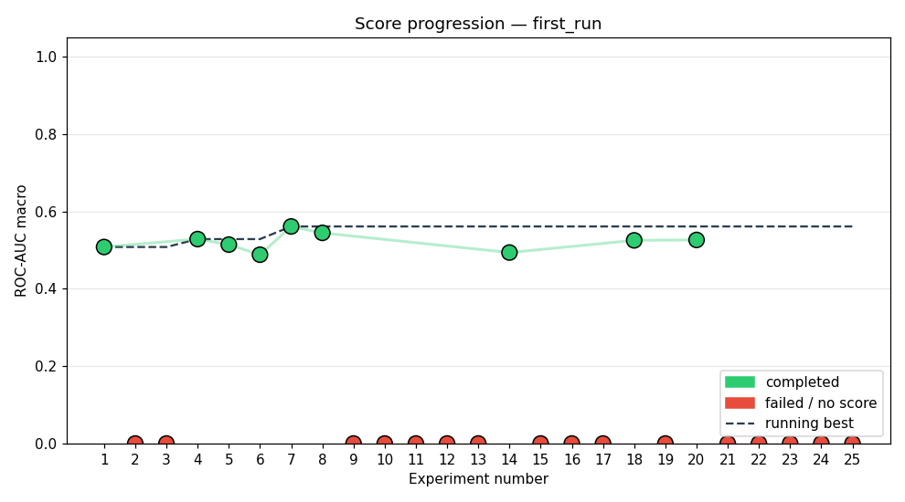
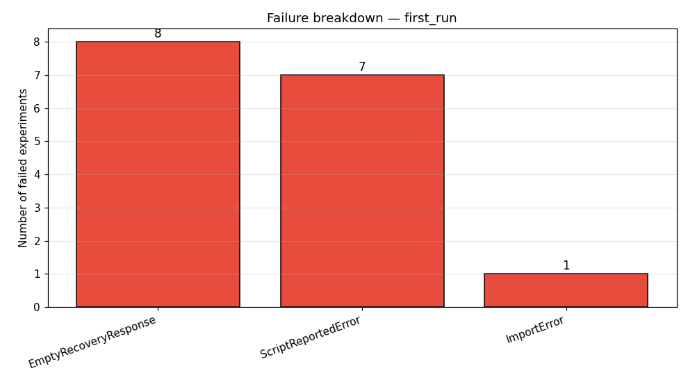

# Study: first_run

## Executive Summary
The BirdCLEF 2026 agent examined 25 architectures in a fixed pipeline, reaching a peak ROC‑AUC of 0.5613 in exp_007. Fifteen runs failed due to errors or empty LLM outputs, leaving a 40 % success rate. The best performance improved 0.0532 over the first successful run (0.5081 → 0.5613).

## Methodology
The agent ran a 25‑experiment pipeline with a 240 min wall‑clock, 7200 s per run, 1 epoch per run, and up to 2 recovery attempts. The LLM drove the agent; each experiment trained a CNN or EfficientNet variant with Adam (lr 0.001, batch 128, weight decay 0.001, dropout 0.1). 25 experiments were attempted, 10 completed, 15 failed.

## Results

Overall success: 10/25 completed (40 %). Best ROC‑AUC = 0.5613, a 0.0532 boost over the first successful run (0.5081).

### Experiment table
| Exp | Status | Architecture | ROC-AUC |
|---|---|---|---|
| exp_001 | completed | cnn_small_v1 | 0.5081 |
| exp_002 | failed | custom 3-conv SE baseline |  |
| exp_003 | failed | 3-conv SE attention network |  |
| exp_004 | completed | 4-layer ResNet block with SE attention | 0.5286 |
| exp_005 | completed | custom 3-conv CNN with dropout | 0.5144 |
| exp_006 | completed | custom 3-conv CNN with SE attention and dropout | 0.4882 |
| exp_007 | completed | custom 3-conv CNN with fused residual blocks and SE attention | 0.5613 |
| exp_008 | completed | cnn_small_v1 | 0.5447 |
| exp_009 | failed | custom 3-conv CNN with fused residual blocks and SE attentio |  |
| exp_010 | failed | custom 3-conv CNN with self-attention and dropout |  |
| exp_011 | failed | EfficientNet-B0 backbone with linear output head |  |
| exp_012 | failed | custom 3-conv CNN with fused residual blocks, SE attention,  |  |
| exp_013 | failed | EfficientNet-B0 truncated to first two blocks + linear head |  |
| exp_014 | completed | 3-conv CNN with fused residual blocks, SE attention, and mix | 0.4938 |
| exp_015 | failed | custom 3-conv CNN with fused residual blocks, SE attention,  |  |
| exp_016 | failed | EfficientNet-B0 full model with linear head |  |
| exp_017 | failed | 3-conv CNN with fused residual blocks and SE attention |  |
| exp_018 | completed | cnn_small_v1 baseline with dropout | 0.5253 |
| exp_019 | failed | 3-conv CNN with fused residual blocks and SE attention |  |
| exp_020 | completed | Enhanced 3-conv CNN with residual SE attention and dropout | 0.5264 |
| exp_021 | failed | ResNet-style 4-block CNN with fused SE attention and adaptiv |  |
| exp_022 | failed | 3‑conv concatenated CNN with residual SE attention and dropo |  |
| exp_023 | failed | (unknown) |  |
| exp_024 | failed | 3-conv baseline with fused SE attention and dropout |  |
| exp_025 | failed | 3-conv CNN with fused SE attention and dropout |  |

## Best Experiment

exp_007 used a custom 3‑conv CNN with fused residual blocks and SE attention. Hyper‑parameters: lr 0.001, batch 128, epochs 1, optimizer adam, weight decay 0.001, dropout 0.1. It achieved ROC‑AUC 0.5613 in a single epoch.

## Failure Analysis

Eight experiments failed with empty LLM recovery codes, indicating the agent’s LLM sometimes returns trivial output. One experiment raised an ImportError (torchvision not found). Seven experienced `RuntimeError` or `TypeError` related to linear layer dimension mismatches or incorrect model initialization.

## Lessons Learned
- The LLM occasionally returns empty or short codes, breaking the recovery loop.  
- Model architectures without explicit torchvision imports cause `ImportError`.  
- Single‑epoch training leads to unstable AUC and shape‑related errors.  
- Deep networks suffer from linear layer dimension mismatches due to batch‑size mismatches.  
- Mixed initializations (e.g., pretrained conv layers) generate `TypeError` when parameters are unsupported.

## Next Steps
- Add validation for LLM responses to avoid empty recovery blobs.  
- Use pre‑built torchvision modules to eliminate ImportError.  
- Extend training to multiple epochs with early stopping.  
- Reduce batch size to 32 to prevent large weight tensors.  
- Log detailed shape mismatches for debugging.
