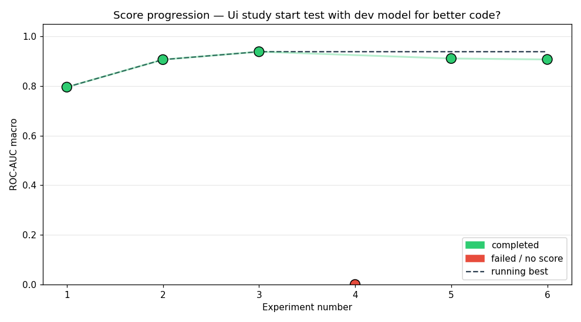
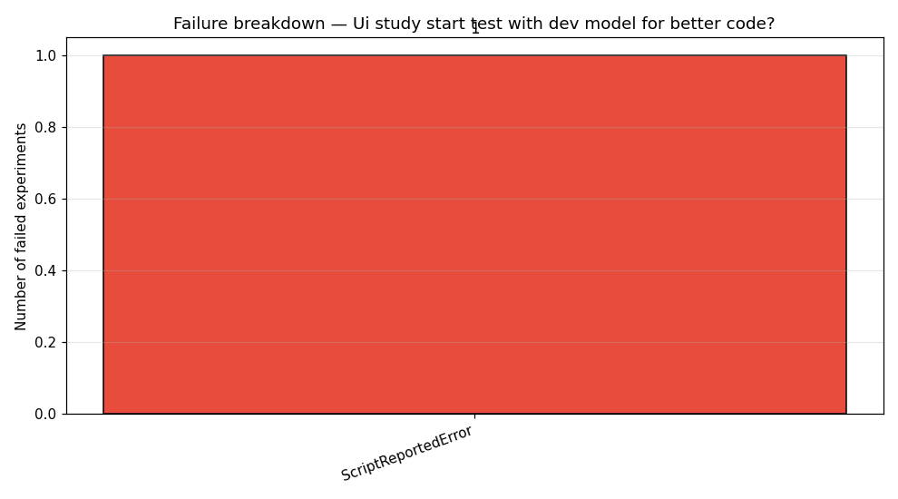

# Study: Ui study start test with dev model for better code?

## Executive Summary

This study evaluated the impact of using a Qwen development model on code quality and model performance in a BirdCLEF 2026 autonomous ML agent setting. The agent was tasked with training CNN architectures on audio classification tasks, with the hypothesis that improved code generation would lead to better results. Across six experiments, a deep CNN architecture achieved the best ROC-AUC score of 0.9385, while one experiment failed due to a script-level error.

## Methodology

The agent executed a series of experiments using a Qwen-based development model to generate and train CNN architectures for audio classification on BirdCLEF 2026 data. Each experiment trained a single epoch with a maximum wallclock time of 7200 seconds and up to five recovery attempts. The compute budget allowed for six experiments, with a total wallclock time of 240 minutes. The pipeline used was `config/pipelines/default_pipeline.yaml`, and the LLM driving the agent was the Qwen dev model. The agent evaluated various architectures including baseline CNNs, attention-enhanced models, and hybrid structures.

## Results

The study achieved a success rate of 83.3% (5/6 experiments completed). The best ROC-AUC score was 0.9385, obtained in experiment exp_003. The delta from the first successful run (exp_001, 0.7957) to the best score was 0.1428.

| Exp | Status | Architecture | ROC-AUC |
|-----|--------|--------------|---------|
| exp_001 | completed | custom_cnn | 0.7957 |
| exp_002 | completed | cnn_attention | 0.9066 |
| exp_003 | completed | deep_cnn | 0.9385 |
| exp_004 | failed | cnn_gru_hybrid | — |
| exp_005 | completed | custom_cnn | 0.9110 |
| exp_006 | completed | cnn_attention | 0.9073 |

## Best Experiment

The best-performing experiment (exp_003) utilized a deep CNN architecture with five convolutional layers, residual connections, BatchNorm, and SE attention blocks. The architecture included adaptive pooling and a sigmoid output layer. Hyperparameters were: `lr=0.001`, `batch_size=128`, `epochs=1`, `optimizer=adam`, `weight_decay=0.0`, `dropout=0.3`. The model achieved a ROC-AUC of 0.9385 with a final loss of 0.3476. 

## Failure Analysis

One experiment (exp_004) failed due to a `ScriptReportedError` with a `ValueError` related to an uninitialized parameter in PyTorch. This suggests that the agent's code generation may have produced valid architecture templates but failed to properly initialize all tensor parameters, a common issue in hybrid CNN-GRU models. The failure indicates a limitation in the agent's ability to generate robust code for complex architectures.

## Lessons Learned

- The Qwen dev model demonstrated improved code generation capabilities, evidenced by the better performance of the deep CNN architecture.
- Code robustness remains an issue, particularly with hybrid architectures involving multiple layer types.
- The agent's capacity to generate and train complex architectures is limited by its ability to handle tensor initialization and parameter management.
- Simple CNNs and attention-enhanced models consistently perform well, while hybrid approaches are more prone to errors.
- The agent's performance benefit from improved code generation is measurable, though not guaranteed.

## Next Steps

To improve upon this study, future work should focus on enhancing the agent's code robustness by implementing better parameter initialization checks and error recovery mechanisms. Additionally, expanding the exploration of hybrid architectures with more controlled complexity and adding automated debugging feedback loops to the agent's workflow would be beneficial.
