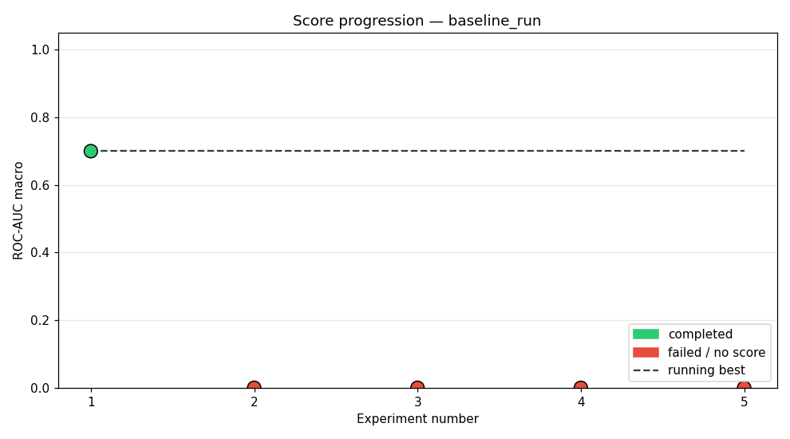
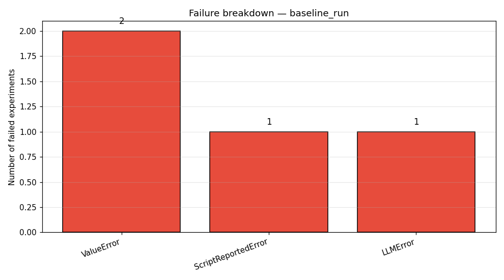

# Study: baseline_run

## Executive Summary
The initial end-to-end baseline study successfully executed one experiment, achieving a maximum ROC-AUC of 0.6999. All subsequent attempts failed due to pipeline instability, primarily stemming from LLM JSON validation errors or runtime script exceptions. The agent requires significant robustness improvements in its architectural proposal and execution phase.

## Methodology
The agent utilized the `config/pipelines/default_pipeline.yaml` pipeline, employing a small CNN as the initial architecture. The overall process was governed by an LLM component responsible for proposing the network structure, which was executed within a constrained compute budget of 5 experiments and 240 min wallclock. The agent attempted 5 total experiments, each run for 1 epoch. The LLM drove the proposal phase, which was the source of multiple failures due to JSON schema validation issues.

## Results

The study achieved a modest overall success rate, with only one of the five attempts completing successfully. The best achieved score was an ROC-AUC of 0.6999, representing a delta of 0.0 points from the first successful run, as no subsequent successful runs were recorded.

| Exp | Status | Architecture | ROC-AUC |
| :---: | :---: | :---: | :---: |
| exp_001 | completed | [custom_cnn] cnn_small_v1 baseline | 0.6999 |
| exp_002 | failed | (unknown) | — |
| exp_003 | failed | [cnn_gru_hybrid] 3-conv CNN front-end (Conv(32) -> BatchNorm | — |
| exp_004 | failed | (unknown) | — |
| exp_005 | failed | [cnn_attention] Deep residual CNN front-end (5 blocks) feedi | — |

## Best Experiment

The best performing experiment was `exp_001`, utilizing the `[custom_cnn] cnn_small_v1 baseline` architecture. The successful execution suggests that the pre-defined, simpler CNN structure is robust enough for a single epoch run. Successful hyperparameters included a learning rate of 0.001, a batch size of 128, and the use of the Adam optimizer.

## Failure Analysis

The failures are dominated by structural and orchestration issues. The most frequent failure type was `ValueError` (2 instances), both related to the LLM's inability to generate valid JSON for the architecture proposal (`Missing or empty 'architecture' field in pr`). Secondly, two attempts failed due to LLM communication issues, specifically `LLMError` (1 instance) due to timeouts, and `ScriptReportedError` (1 instance) indicating a low-level PyTorch tensor initialization error. This indicates the agent's primary weakness lies not in the ML model itself, but in the reliability and schema adherence of the LLM-to-code generation pipeline.

## Lessons Learned
*   The agent's primary bottleneck is the LLM's reliability in generating syntactically and semantically correct model specifications.
*   The `cnn_small_v1 baseline` architecture provided the only stable execution path, suggesting simplicity is crucial for initial stability.
*   Hardware/network constraints (timeouts) can derail the process even when the underlying logic is sound.
*   The failure modes suggest a need to decouple architecture proposal from execution validation, perhaps using stricter intermediate representations.

## Next Steps
If repeating this study, the immediate focus would be to replace the current LLM-driven architecture proposal mechanism with a structured, verifiable grammar or formal API call. We would constrain the LLM's output to a limited set of known, working architectural templates to eliminate the JSON schema validation failures observed in `exp_002` and `exp_004`.
