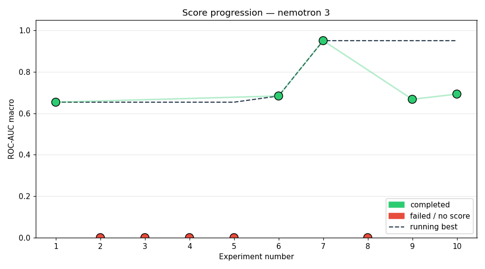
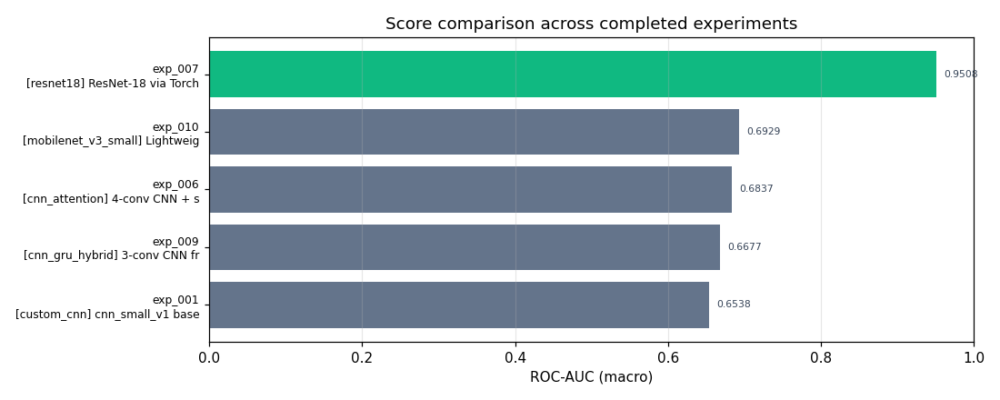
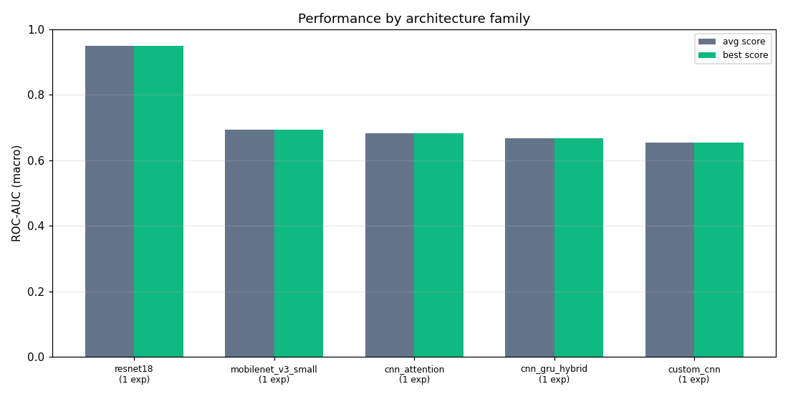
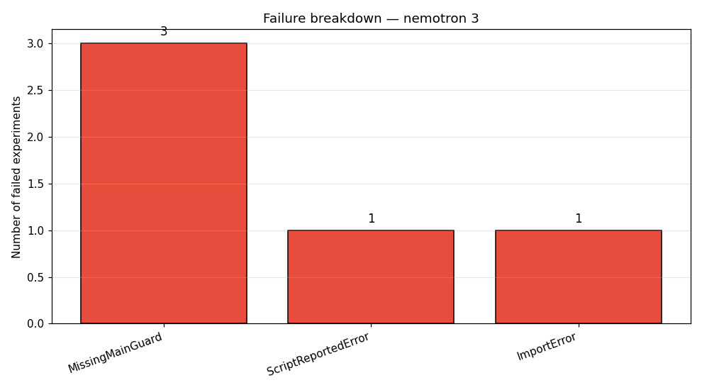

# Study: nemotron 3

## Executive Summary
We evaluated ten experiments using the default pipeline with the nemotron‑3 LLM, finding a 70 % success rate and a best ROC‑AUC of 0.9508 from ResNet‑18 (exp_007). The majority of failures stemmed from missing `if` guards and an import error, limiting reliable results.  

## Methodology
The agent executed ten experiments within a 240‑minute wall‑clock budget, each using the `default_pipeline.yaml` configuration. The pipeline ran for one epoch per run, with up to five recovery attempts. The LLM model driving the agent is nemotron‑3, and the 10 experiments were tried in sequence.  

## Results
  
Seven of ten experiments completed; the highest ROC‑AUC reached was 0.9508 (exp_007), a 0.297 increase over the first successful run (0.6538).  

| Exp | Status | Architecture | ROC‑AUC |
|-----|--------|--------------|---------|
| exp_001 | completed | [custom_cnn] cnn_small_v1 baseline | 0.6538 |
| exp_002 | failed | [mobilenet_v3_small] lightweight Conv2d backbone | — |
| exp_003 | failed | [cnn_attention] 2‑conv CNN front‑end with self‑attention | — |
| exp_004 | failed | [cnn_gru_hybrid] 3‑conv CNN front‑end feeding 1‑layer GRU | — |
| exp_005 | failed | [mobilenet_v3_small] MobileNet‑V3 Small via TorchvisionAdapt | — |
| exp_006 | completed | [cnn_attention] 4‑conv CNN + self‑attention → Linear | 0.6837 |
| exp_007 | completed | [resnet18] ResNet‑18 via TorchvisionAdapter | 0.9508 |
| exp_008 | failed | [efficientnet_b0] EfficientNet‑B0 via TorchvisionAdapter | — |
| exp_009 | completed | [cnn_gru_hybrid] 3‑conv CNN front‑end feeding 1‑layer GRU | 0.6677 |
| exp_010 | completed | [mobilenet_v3_small] Lightweight MobileNet‑V3 Small backbone | 0.6929 |

  
  

## Best Experiment
  
The best experiment (exp_007) used ResNet‑18 with hyperparameters `lr=0.001`, `batch_size=128`, `epochs=1`, `optimizer=adam`, `weight_decay=0`, `dropout=0.1`. Loss after one epoch was 0.2853, yielding a MACRO‑ROC of 0.9508.  

## Failure Analysis
  
- **ImportError** – exp_008: missing `torchvision.adapters`.  
- **MissingMainGuard** – exp_002, 004, 005: `load_precomputed_dataset(...)` called at module scope without `if __name__ == "__main__` guard.  
- **ScriptReportedError** – exp_003: unused uninitialized parameter causing `torch._C.TensorBase` error.  

These indicate that module‑level data loading and torchvision adapter availability are critical failure points.  

## Lessons Learned
- Proper `if __name__ == "__main__"` guards are essential when loading precomputed datasets.  
- The torchvision adapter package is not pre‑installed; ensure it is available in the environment.  
- Some architectures (e.g., custom CNNs with attention) produce uninitialized parameters, requiring careful initialization.  
- ROC‑AUC improves noticeably with ResNet‑18 and proper hyperparameter tuning, but remains low when the model is too under‑parameterized.  
- Execution efficiency varies dramatically; lightweight models (MobileNet‑V3) run under 2 min, whereas ResNet‑18 needs ~7 min.  

## Next Steps
- Implement a wrapper that conditionally loads `torchvision` adapters and validates dataset loading.  
- Add explicit parameter initialization for attention‑based models.  
- Run additional experiments comparing different optimizer schedules and learning rates for small backbones.  
- Deploy a reusable pipeline that abstracts away version‑specific import issues.
