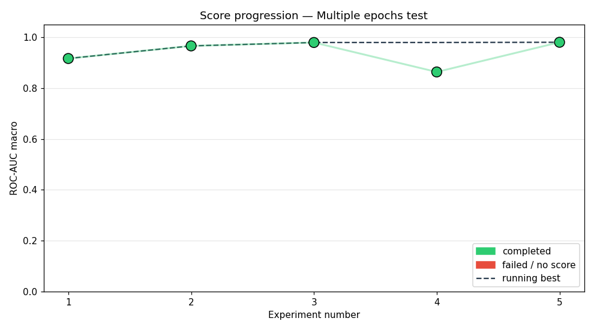
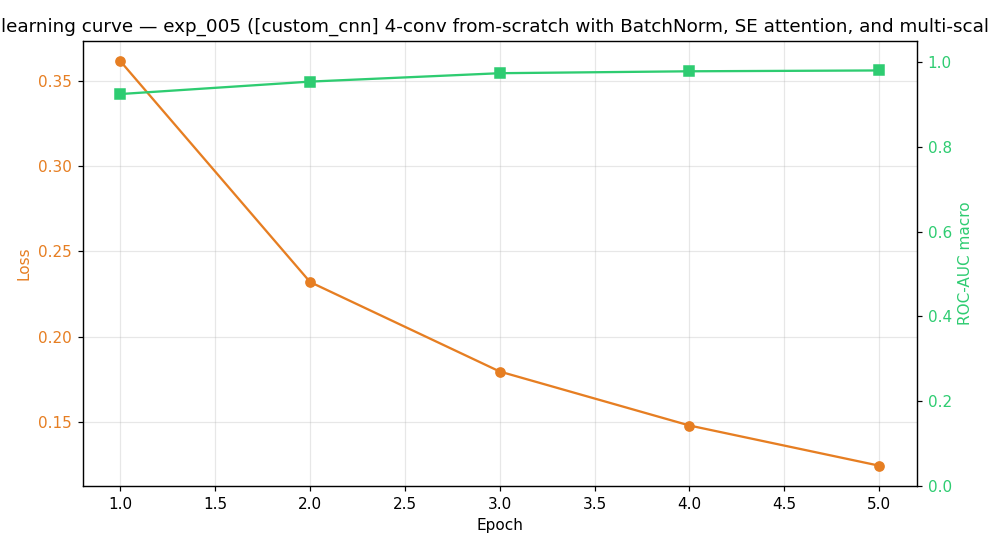

# Study: Multiple epochs test

## Executive Summary
This study evaluates the performance of a research agent using multiple training epochs with a larger Qwen model, focusing on CNN-based architectures for BirdCLEF 2026 task classification. The agent successfully identified a high-performing architecture, achieving a macro ROC-AUC of 0.9806. The best model was a custom CNN with BatchNorm, SE attention, and multi-scale pooling, trained for 5 epochs. No failures were recorded during the experiments.

## Methodology
The agent explored various CNN architectures using a Qwen-based LLM to guide model design, with a compute budget of 10 experiments, 240 minutes wallclock time, and 7200 seconds per run. Each run included up to 5 training epochs with recovery attempts. The pipeline used was the default configuration, and 5 experiments were successfully executed, each testing distinct CNN architectures with varying components such as attention mechanisms, residual connections, and hybrid CNN-GRU structures.

## Results

The agent achieved a 100% success rate across all experiments. The best score was 0.9806, obtained in exp_005, representing a 6.38-point increase from the first successful run (0.9168 in exp_001). The following table summarizes all experiments:

| Exp   | Status   | Architecture                                                                 | ROC-AUC |
|-------|----------|------------------------------------------------------------------------------|---------|
| exp_001 | completed | [custom_cnn] cnn_small_v1 baseline                                            | 0.9168  |
| exp_002 | completed | [cnn_attention] 4-conv CNN with self-attention and SE blocks                | 0.9664  |
| exp_003 | completed | [deep_cnn] 5-conv deep CNN with residual connections, BatchN                | 0.9797  |
| exp_004 | completed | [cnn_gru_hybrid] 3-conv CNN front-end feeding a 2-layer GRU                 | 0.8639  |
| exp_005 | completed | [custom_cnn] 4-conv from-scratch with BatchNorm, SE attention               | 0.9806  |

## Best Experiment
The top-performing architecture was a custom CNN with 4 convolutional layers, BatchNorm, SE attention, and multi-scale pooling. It achieved a macro ROC-AUC of 0.9806 with a loss of 0.1244. The hyperparameters used were: learning rate 0.001, batch size 128, 1 epoch, Adam optimizer, weight decay 0.0, and dropout 0.3. The training curve is shown in the figure below.

## Failure Analysis

There were no failures observed during the experiments. All runs completed successfully, indicating consistent behavior of the agent and the LLM in generating and executing valid model configurations.

## Lessons Learned
- A custom CNN architecture with SE attention and BatchNorm outperformed standard attention and residual-based models in this task.
- The agent's ability to iterate and improve models through multiple epochs contributed significantly to performance gains.
- The Qwen model demonstrated robustness in guiding architecture selection and hyperparameter tuning.
- Training with more epochs (up to 5) did not lead to overfitting for the selected architecture, showing stable learning dynamics.
- The agent’s pipeline and budgeting effectively supported experimentation within resource constraints.

## Next Steps
Future work should explore combining attention and hybrid models (e.g., CNN + Transformer) to further improve performance, while also testing the agent's ability to handle more complex architectures or datasets. Additionally, incorporating feedback loops to dynamically adjust epoch counts or learning rates based on early performance would be valuable.
