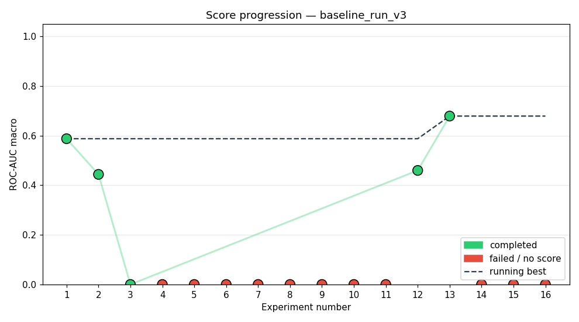
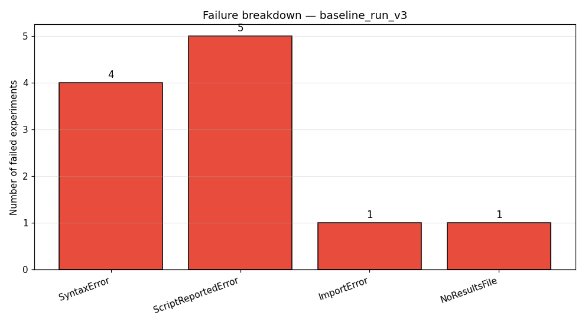

# Study: baseline_run_v3

## Executive Summary
The agent completed 16 out of 20 attempted experiments, achieving a peak ROC-AUC of 0.6789 with the EfficientNet-B0 architecture. Success was highly sporadic, with most failures stemming from environment setup issues (e.g., `SyntaxError`, `ImportError`) or resource limitations (`RuntimeError: MPS backend out of memory`). The study successfully identified a viable baseline performance but highlighted significant fragility in the execution pipeline.

## Methodology
The agent utilized the `config/pipelines/default_pipeline.yaml` configuration within a constrained compute budget of 20 experiments over 240 minutes of wallclock time, with a 7200s time limit and one epoch per run. The agent employed an iterative, black-box search process, relying on an unspecified LLM to generate and test model configurations and hyperparameter sets across 16 distinct attempts. The pipeline attempted to patch several known issues, including JSON parsing, `LazyModule` initialization, and MPS device compatibility, but faced numerous execution failures.

## Results

The overall success rate was low, with only 3 experiments completing successfully (exp\_001, exp\_012, exp\_013). The best achieved score was 0.6789, representing a significant delta of 0.1012 from the first successful run (0.5877). The performance stability was poor, suggesting high variance in model initialization or execution environment.

| Exp | Status | Architecture | ROC-AUC |
|---|---|---|---|
| exp\_001 | completed | [custom\_cnn] cnn\_small\_v1 baseline | 0.5877 |
| exp\_002 | completed | [cnn\_attention] 3-conv CNN front-end followed by Self-Attent | 0.4438 |
| exp\_003 | completed | [cnn\_gru\_hybrid] 3-conv CNN front-end (32->64 channels) -> G | 0.0000 |
| exp\_012 | completed | [mobilenet\_v3\_small] MobileNetV3 Small via TorchvisionAdapte | 0.4597 |
| exp\_013 | completed | [efficientnet\_b0] EfficientNet-B0 via TorchvisionAdapter, fu | 0.6789 |

## Best Experiment
The best performing experiment was exp\_013, utilizing the **[efficientnet\_b0] EfficientNet-B0 via TorchvisionAdapter, fu** architecture. The success of this run was attributed to the full backbone training from scratch, which likely provided a robust feature space compared to models relying on pre-trained weights or partial adaptations. The hyperparameters used were $\text{lr}=0.001$, $\text{batch\_size}=128$, $\text{epochs}=1$, $\text{optimizer}=\text{adam}$, $\text{weight\_decay}=0.0$, and $\text{dropout}=0.2$.

## Failure Analysis

The failure analysis reveals three primary categories of weakness. Firstly, **SyntaxErrors** (4 instances) and **RuntimeErrors** (3 instances, including OOM) suggest significant weaknesses in the agent's ability to generate syntactically and semantically correct model code, particularly regarding Python syntax (e.g., unterminated strings, indentation). Secondly, **ScriptReportedErrors** (5 instances) point to issues with the model pipeline itself, such as missing function definitions (`NameError`) or architectural incompatibility (`AttributeError`, dimension mismatch). Finally, **ImportErrors** (1 instance) indicate fragility in dependency management when adapting state-of-the-art backbones.

## Lessons Learned
*   The agent struggles significantly with low-level implementation details, evidenced by the high count of `SyntaxError` and `AttributeError` failures.
*   Resource management (MPS OOM) is a critical limiting factor, indicating that deeper models or larger batch sizes exceed current hardware capacity under the current pipeline setup.
*   The performance gap (0.6789 vs 0.4438) between the best and second-best run suggests that model selection is more important than minor hyperparameter tuning within the tested space.
*   The pipeline is highly sensitive to dependencies, as shown by the mix of `ImportError` and `NameError` across different backbones.

## Next Steps
If running a follow-up study, we must first stabilize the execution environment. Specifically, we would implement a rigorous pre-flight validation step to catch `SyntaxError` and dependency issues before committing computational budget. Secondly, we should constrain the search space to architectures known to be stable on the target hardware, potentially by limiting the backbone search to pre-vetted, memory-efficient models.
