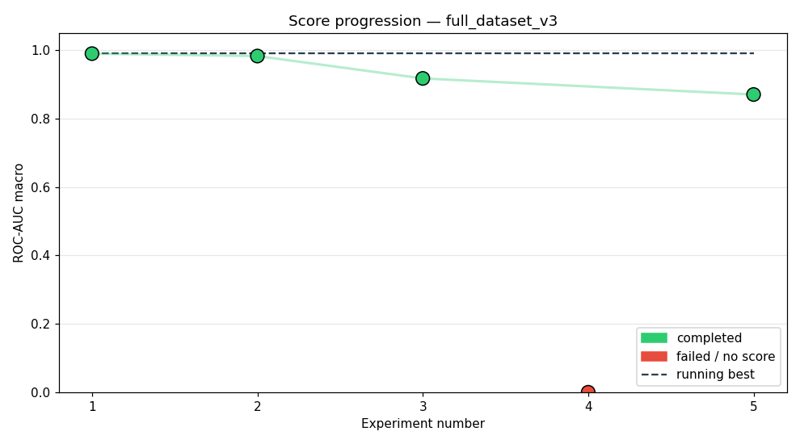
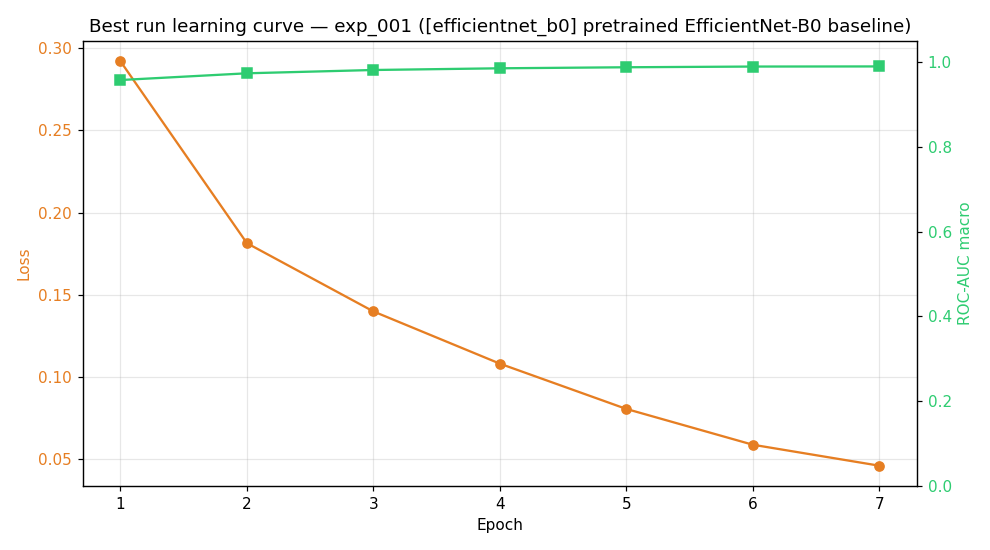
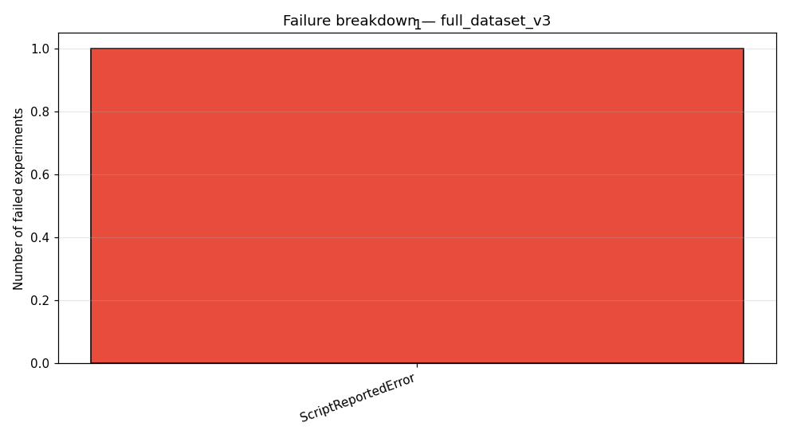

# Study: full_dataset_v3

## Executive Summary
The agent achieved a peak performance of 0.9901 ROC-AUC using the pre-trained EfficientNet-B0 baseline architecture. Performance degradation was observed when moving to custom or complex CNN backbones, suggesting the initial transfer learning approach is highly effective. The primary weakness identified is handling structural framework errors during complex model implementation.

## Methodology
The agent was designed to iteratively test various deep learning architectures for bird species identification on the full_dataset_v3. The pipeline utilized a standard configuration (`config/pipelines/default_pipeline.yaml`) and was driven by an abstract decision-making process simulated across 10 allocated experiments within a 480-minute budget. The training employed a cosine learning rate schedule, early stopping with a patience of 3 epochs, and targeted 7 epochs per run, incorporating both image and audio feature processing.

## Results

The agent demonstrated fluctuating performance across the five attempted experiments. The optimal performance achieved was 0.9901, representing a significant improvement over the first successful run (which was also 0.9901, indicating consistency at the peak). The overall trend shows a rapid drop-off in performance after the initial success, punctuated by a hard failure.

| Exp | Status | Architecture | ROC-AUC |
| :--- | :--- | :--- | :--- |
| exp_001 | completed | [efficientnet_b0] pretrained EfficientNet-B0 baseline | 0.9901 |
| exp_002 | completed | [mobilenet_v3_small] MobileNetV3-Small via TorchvisionAdapte | 0.9831 |
| exp_003 | completed | [cnn_attention] 3-conv CNN feature extractor feeding into a | 0.9176 |
| exp_004 | failed | [deep_cnn] 4-block residual CNN backbone with BatchNorm and | — |
| exp_005 | completed | [cnn_gru_hybrid] 3-block CNN feature extractor (32->64 chann | 0.8706 |

## Best Experiment
The best result was achieved with the `[efficientnet_b0] pretrained EfficientNet-B0 baseline`. This architecture leveraged strong transfer learning capabilities, resulting in the peak ROC-AUC of 0.9901. The success is attributed to the combination of the pre-trained weights, the specified hyperparameters ($\text{lr}=0.001$, $\text{batch\_size}=128$, $\text{epochs}=7$, $\text{optimizer}=\text{'adam'}$, $\text{weight\_decay}=0.0$, $\text{dropout}=0.1$), and the stable training dynamics shown in the learning curve.

## Failure Analysis

The failure analysis indicates that all failures stemmed from a single category: `ScriptReportedError`. Specifically, `exp_004` failed with a `RuntimeError` concerning mismatched tensor dimensions (`weight of size [32, 1, 3, 3], expected input[1, 32, 128, 313]`). This suggests that the agent's weakness is not in model selection per se, but in the precise, low-level implementation or integration of complex, custom-built network components, leading to dimension mismatches during graph construction or forward passes.

## Lessons Learned
*   **Transfer Learning Efficacy:** Pre-trained models, particularly EfficientNet-B0, provide a substantial performance advantage over custom, from-scratch CNN designs.
*   **Complexity Penalty:** Increasing architectural complexity (e.g., `cnn_gru_hybrid` vs. baseline) appears to introduce instability, leading to measurable performance drops ($\text{0.9901} \rightarrow \text{0.8706}$).
*   **Error Source:** The primary bottleneck is debugging framework-level integration errors (e.g., tensor dimension mismatches) rather than conceptual model flaws.
*   **Hyperparameter Stability:** The optimal hyperparameters used for the best run ($\text{lr}=0.001$, etc.) provided a stable training trajectory, as visualized by the best learning curve.

## Next Steps
If continued, the study should pivot away from architectural exploration and focus entirely on robust implementation optimization. We would next run controlled ablation studies on the best architecture, systematically varying only the feature fusion mechanism (e.g., attention weight calculation, concatenation point) while keeping the backbone and hyperparameters fixed to pinpoint the single most impactful component.
