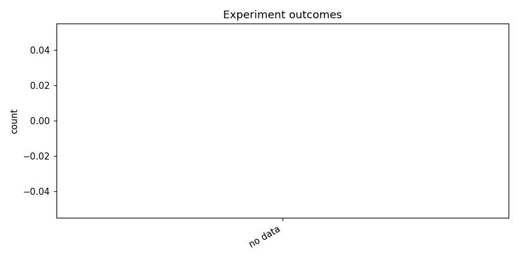

# Test opus4.6 + kaggle gpus

_Task: **track_b** · Primary metric: **f1_macro** · Status: **StudyStatus.FAILED**_

## Executive summary

Across 0 experiments (0 successful, 0 failed), the best configuration achieved f1_macro = 0.0000. See the per-family breakdown below for which architecture families dominated and which failed modes were most common.

## Overview

| | |
|---|---|
| Study ID | `study_20260414_101912_70cb` |
| Started | 2026-04-14 10:19:12.443004+00:00 |
| Finished | 2026-04-15 06:10:51.773746+00:00 |
| Experiments | 0 (0 succeeded, 0 failed) |
| Best f1_macro | **—** |
| Predecessor | — |
| Published | no |
| Tags | opus4.6, kaggle |

## Metric trajectory

## Per-architecture-family breakdown

| Family | Runs | Best f1_macro | Mean f1_macro |
|---|---:|---:|---:|

## Failure analysis

| Error type | Count | Example message |
|---|---:|---|

## Prompt versions used

| Prompt task | File |
|---|---|
| propose_architecture | `/Users/max/Documents/Master/Courses/Advanced Predictive Analytics/Group Work/advanced-topics-in-predictive-analytics-group/config/prompts/propose_architecture/v1.yaml` |
| generate_code | `/Users/max/Documents/Master/Courses/Advanced Predictive Analytics/Group Work/advanced-topics-in-predictive-analytics-group/config/prompts/generate_code/v1.yaml` |
| analyze_result | `/Users/max/Documents/Master/Courses/Advanced Predictive Analytics/Group Work/advanced-topics-in-predictive-analytics-group/config/prompts/analyze_result/v1.yaml` |
| recover_from_error | `/Users/max/Documents/Master/Courses/Advanced Predictive Analytics/Group Work/advanced-topics-in-predictive-analytics-group/config/prompts/recover_from_error/v1.yaml` |
| executive_summary | `/Users/max/Documents/Master/Courses/Advanced Predictive Analytics/Group Work/advanced-topics-in-predictive-analytics-group/config/prompts/executive_summary/v1.yaml` |

## All experiments

| # | ID | Status | Architecture | f1_macro | Duration (s) |
|---:|---|---|---|---:|---:|
