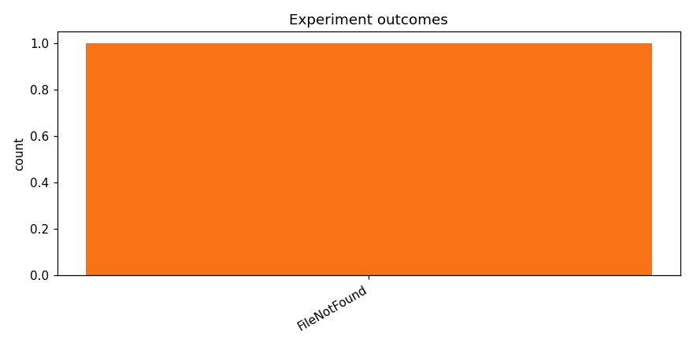

# Test opus with local training

_Task: **track_b** · Primary metric: **f1_macro** · Status: **StudyStatus.COMPLETED**_

## Executive summary

Across 1 experiments (0 successful, 1 failed), the best configuration achieved f1_macro = 0.0000. See the per-family breakdown below for which architecture families dominated and which failed modes were most common.

## Overview

| | |
|---|---|
| Study ID | `study_20260414_120416_6fd7` |
| Started | 2026-04-14 12:04:16.328917+00:00 |
| Finished | 2026-04-14 12:05:50.137367+00:00 |
| Experiments | 1 (0 succeeded, 1 failed) |
| Best f1_macro | **—** |
| Predecessor | — |
| Published | no |
| Tags | opus4.6, local |

## Metric trajectory

## Per-architecture-family breakdown

| Family | Runs | Best f1_macro | Mean f1_macro |
|---|---:|---:|---:|

## Failure analysis

| Error type | Count | Example message |
|---|---:|---|
| FileNotFound | 1 | `raise FileNotFoundError(` |

## Prompt versions used

| Prompt task | File |
|---|---|
| propose_architecture | `/Users/max/Documents/Master/Courses/Advanced Predictive Analytics/Group Work/advanced-topics-in-predictive-analytics-group/config/prompts/propose_architecture/v1.yaml` |
| generate_code | `/Users/max/Documents/Master/Courses/Advanced Predictive Analytics/Group Work/advanced-topics-in-predictive-analytics-group/config/prompts/generate_code/v1.yaml` |
| analyze_result | `/Users/max/Documents/Master/Courses/Advanced Predictive Analytics/Group Work/advanced-topics-in-predictive-analytics-group/config/prompts/analyze_result/v1.yaml` |
| recover_from_error | `/Users/max/Documents/Master/Courses/Advanced Predictive Analytics/Group Work/advanced-topics-in-predictive-analytics-group/config/prompts/recover_from_error/v1.yaml` |
| executive_summary | `/Users/max/Documents/Master/Courses/Advanced Predictive Analytics/Group Work/advanced-topics-in-predictive-analytics-group/config/prompts/executive_summary/v1.yaml` |

## All experiments

| # | ID | Status | Architecture | f1_macro | Duration (s) |
|---:|---|---|---|---:|---:|
| 1 | `exp_70e5f3680f` | ExperimentStatus.FAILED | [efficientnet_b0] efficientnet_b0_adapter | — | 0.6 |
