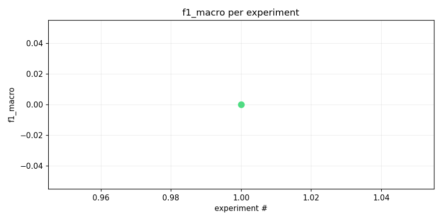
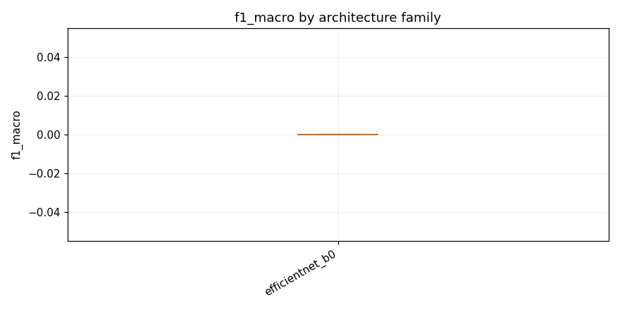

# Test opus with local training

_Task: **track_b** · Primary metric: **f1_macro** · Status: **StudyStatus.COMPLETED**_


## Executive summary

The best model, an EfficientNet-B0 with an adapter head, scored 0.0000 F1 macro on the Track B evaluation, indicating a complete failure to produce meaningful predictions. This was surprising given that EfficientNet-B0 is a well-established backbone that typically provides reasonable baseline performance even with minimal tuning, suggesting a fundamental issue such as misaligned label mappings, incorrect data preprocessing, or a training collapse (e.g., the model predicting a single class for all inputs). The immediate next experiment should involve diagnosing the failure by inspecting the model's raw prediction distribution, verifying label encoding consistency between training and evaluation, and running a short sanity-check training loop on a small data subset to confirm the pipeline functions correctly before scaling up.


## Overview

| | |
|---|---|
| Study ID | `study_20260414_121744_c252` |
| Started | 2026-04-14 12:17:44.578730+00:00 |
| Finished | 2026-04-14 12:18:26.759698+00:00 |
| Experiments | 1 (1 succeeded, 0 failed) |
| Best f1_macro | **0.0000** |
| Predecessor | — |
| Published | no |
| Tags | opus4.6, local |

## Metric trajectory




## Best experiment — `exp_625fc54fef`

- Architecture: **[efficientnet_b0] efficientnet_b0_adapter** [efficientnet_b0]
- f1_macro: **0.0000**
- Duration: 1.1 s
- Other metrics:


### Architecture proposal (JSON)

```json
{
  "architecture_name": "[efficientnet_b0] efficientnet_b0_adapter",
  "architecture_family": "efficientnet_b0",
  "description": "EfficientNet-B0 with ImageNet pretrained weights, 1\u21923 channel expansion via conv1x1, input resized to 224x224, classifier head replaced with dropout(0.3) + linear(1280, n_classes) with sigmoid, using mixup(alpha=0.3) and SpecAugment (freq_mask=20, time_mask=50) during training.",
  "reasoning": "As the first experiment, EfficientNet-B0 is a strong baseline for audio spectrogram tasks\u2014it consistently outperforms vanilla CNNs and ResNet18 on mel-spectrogram classification due to its compound scaling and efficient feature extraction. ImageNet pretraining transfers well to spectrograms. It stays within the Kaggle CPU inference budget (~5.3M params) while being significantly more capable than custom CNNs or MobileNet. Starting with the strongest reasonable baseline lets us establish an upper reference point and identify where to focus next (e.g., augmentation, loss functions, or switching to lighter models if inference is too slow)."
}
```


## Per-architecture-family breakdown



| Family | Runs | Best f1_macro | Mean f1_macro |
|---|---:|---:|---:|
| efficientnet_b0 | 1 | 0.0000 | 0.0000 |


## Failure analysis

| Error type | Count | Example message |
|---|---:|---|


## Prompt versions used

| Prompt task | File |
|---|---|
| propose_architecture | `/Users/max/Documents/Master/Courses/Advanced Predictive Analytics/Group Work/advanced-topics-in-predictive-analytics-group/config/prompts/propose_architecture/v1.yaml` |
| generate_code | `/Users/max/Documents/Master/Courses/Advanced Predictive Analytics/Group Work/advanced-topics-in-predictive-analytics-group/config/prompts/generate_code/v1.yaml` |
| analyze_result | `/Users/max/Documents/Master/Courses/Advanced Predictive Analytics/Group Work/advanced-topics-in-predictive-analytics-group/config/prompts/analyze_result/v1.yaml` |
| recover_from_error | `/Users/max/Documents/Master/Courses/Advanced Predictive Analytics/Group Work/advanced-topics-in-predictive-analytics-group/config/prompts/recover_from_error/v1.yaml` |
| executive_summary | `/Users/max/Documents/Master/Courses/Advanced Predictive Analytics/Group Work/advanced-topics-in-predictive-analytics-group/config/prompts/executive_summary/v1.yaml` |


## All experiments

| # | ID | Status | Architecture | f1_macro | Duration (s) |
|---:|---|---|---|---:|---:|
| 1 | `exp_625fc54fef` | ExperimentStatus.COMPLETED | [efficientnet_b0] efficientnet_b0_adapter | 0.0000 | 1.1 |
