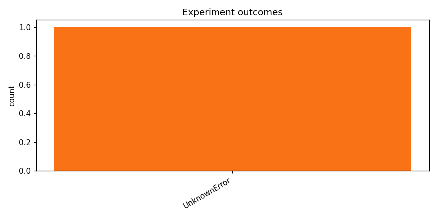

# Test opus with local training

_Task: **track_b** · Primary metric: **f1_macro** · Status: **StudyStatus.FAILED**_

## Executive summary

**Executive Summary**

No model achieved a successful run on the Track B task, with the best macro F1 score remaining at 0.0000 across the single attempted experiment, which failed during execution. The most surprising finding was that even a single baseline experiment could not complete successfully, suggesting fundamental issues with either the data pipeline, environment configuration, or task setup rather than model architecture choices. As a concrete next step, I recommend conducting a thorough debugging run with a minimal, simplified pipeline—such as a basic logistic regression or small fine-tuned transformer on a data subset—to isolate whether the failure stems from data loading, preprocessing, or model training, before scaling to more complex architectures.

## Overview

| | |
|---|---|
| Study ID | `study_20260414_122628_1920` |
| Started | 2026-04-14 12:26:28.680373+00:00 |
| Finished | 2026-04-14 12:29:07.746383+00:00 |
| Experiments | 1 (0 succeeded, 1 failed) |
| Best f1_macro | **—** |
| Predecessor | — |
| Published | no |
| Tags | opus4.6, local |

## Metric trajectory

## Per-architecture-family breakdown

| Family | Runs | Best f1_macro | Mean f1_macro |
|---|---:|---:|---:|

## Failure analysis

| Error type | Count | Example message |
|---|---:|---|
| UnknownError | 1 | `KeyError: 'filename'` |

## Prompt versions used

| Prompt task | File |
|---|---|
| propose_architecture | `/Users/max/Documents/Master/Courses/Advanced Predictive Analytics/Group Work/advanced-topics-in-predictive-analytics-group/config/prompts/propose_architecture/v1.yaml` |
| generate_code | `/Users/max/Documents/Master/Courses/Advanced Predictive Analytics/Group Work/advanced-topics-in-predictive-analytics-group/config/prompts/generate_code/v1.yaml` |
| analyze_result | `/Users/max/Documents/Master/Courses/Advanced Predictive Analytics/Group Work/advanced-topics-in-predictive-analytics-group/config/prompts/analyze_result/v1.yaml` |
| recover_from_error | `/Users/max/Documents/Master/Courses/Advanced Predictive Analytics/Group Work/advanced-topics-in-predictive-analytics-group/config/prompts/recover_from_error/v1.yaml` |
| executive_summary | `/Users/max/Documents/Master/Courses/Advanced Predictive Analytics/Group Work/advanced-topics-in-predictive-analytics-group/config/prompts/executive_summary/v1.yaml` |

## All experiments

| # | ID | Status | Architecture | f1_macro | Duration (s) |
|---:|---|---|---|---:|---:|
| 1 | `exp_42a9b76493` | ExperimentStatus.FAILED | [efficientnet_b0] effnet_b0_mixup_heavy_dropout | — | 1.1 |
