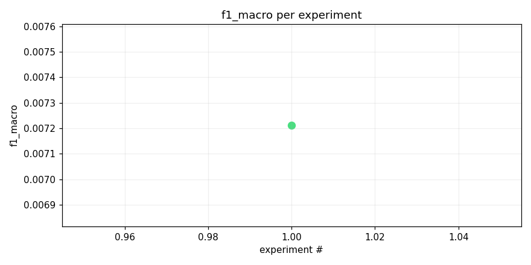
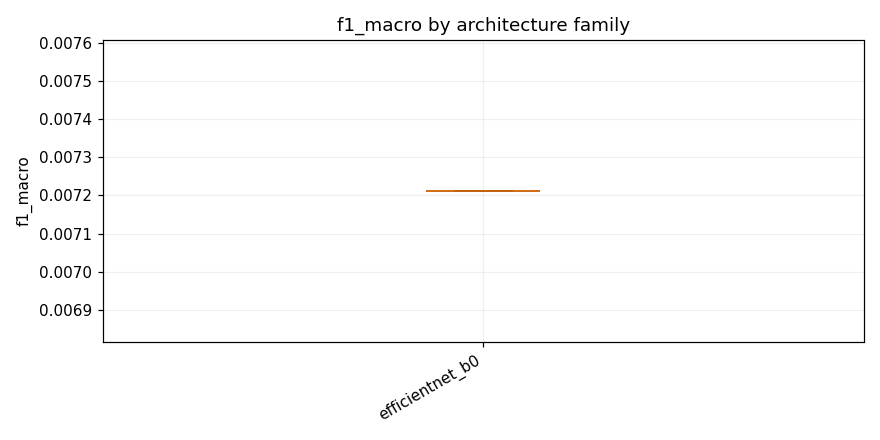

# Test opus with local training

_Task: **track_b** · Primary metric: **f1_macro** · Status: **StudyStatus.ABORTED**_


## Executive summary

The best model achieved an F1 macro score of 0.0072 on Track B, using an EfficientNet-B0 architecture with mixup augmentation and heavy dropout regularization. This result is extremely low, suggesting the model is struggling significantly with the classification task—surprisingly, even with aggressive regularization techniques like mixup and heavy dropout that typically help with limited or imbalanced data, the model failed to learn meaningful discriminative features across most classes. This near-zero performance likely indicates severe class imbalance, insufficient training data, or a fundamental mismatch between the model capacity and task complexity. The next experiment should investigate class-wise performance diagnostics and explore focal loss or class-weighted sampling strategies to address potential imbalance issues.


## Overview

| | |
|---|---|
| Study ID | `study_20260414_123310_e1ea` |
| Started | 2026-04-14 12:33:10.713080+00:00 |
| Finished | 2026-04-14 13:01:34.072049+00:00 |
| Experiments | 1 (1 succeeded, 0 failed) |
| Best f1_macro | **0.0072** |
| Predecessor | — |
| Published | no |
| Tags | opus4.6, local |

## Metric trajectory




## Best experiment — `exp_17aed7911f`

- Architecture: **[efficientnet_b0] effnet_b0_mixup_heavy_dropout** [efficientnet_b0]
- f1_macro: **0.0072**
- Duration: 484.5 s
- Other metrics:
  - `f1_macro` = 0.0072
  - `roc_auc_macro` = nan
  - `loss` = 0.0324
  - `epoch` = 1.0000


### Architecture proposal (JSON)

```json
{
  "architecture_name": "[efficientnet_b0] effnet_b0_mixup_heavy_dropout",
  "architecture_family": "efficientnet_b0",
  "description": "EfficientNet-B0 pretrained on ImageNet with 1\u21923 channel expansion, input resized to 224\u00d7224, classifier head replaced with Dropout(0.4)\u2192Linear(1280,512)\u2192ReLU\u2192Dropout(0.3)\u2192Linear(512,206) with sigmoid output, trained with mixup (alpha=0.5) and BCEWithLogitsLoss for multi-label classification.",
  "reasoning": "As the first experiment, EfficientNet-B0 is the strongest pretrained backbone that still fits within Kaggle CPU inference budgets (~5M params). ImageNet pretraining transfers well to mel-spectrogram tasks. Heavy dropout (0.4+0.3) and mixup help with the long-tail class imbalance. The two-layer head with 512 hidden units gives enough capacity for 206 classes without being too slow. This establishes a strong baseline to iterate from."
}
```


## Per-architecture-family breakdown



| Family | Runs | Best f1_macro | Mean f1_macro |
|---|---:|---:|---:|
| efficientnet_b0 | 1 | 0.0072 | 0.0072 |


## Failure analysis

| Error type | Count | Example message |
|---|---:|---|


## Prompt versions used

| Prompt task | File |
|---|---|
| propose_architecture | `/Users/max/Documents/Master/Courses/Advanced Predictive Analytics/Group Work/advanced-topics-in-predictive-analytics-group/config/prompts/propose_architecture/v1.yaml` |
| generate_code | `/Users/max/Documents/Master/Courses/Advanced Predictive Analytics/Group Work/advanced-topics-in-predictive-analytics-group/config/prompts/generate_code/v1.yaml` |
| analyze_result | `/Users/max/Documents/Master/Courses/Advanced Predictive Analytics/Group Work/advanced-topics-in-predictive-analytics-group/config/prompts/analyze_result/v1.yaml` |
| recover_from_error | `/Users/max/Documents/Master/Courses/Advanced Predictive Analytics/Group Work/advanced-topics-in-predictive-analytics-group/config/prompts/recover_from_error/v1.yaml` |
| executive_summary | `/Users/max/Documents/Master/Courses/Advanced Predictive Analytics/Group Work/advanced-topics-in-predictive-analytics-group/config/prompts/executive_summary/v1.yaml` |


## All experiments

| # | ID | Status | Architecture | f1_macro | Duration (s) |
|---:|---|---|---|---:|---:|
| 1 | `exp_17aed7911f` | ExperimentStatus.COMPLETED | [efficientnet_b0] effnet_b0_mixup_heavy_dropout | 0.0072 | 484.5 |
