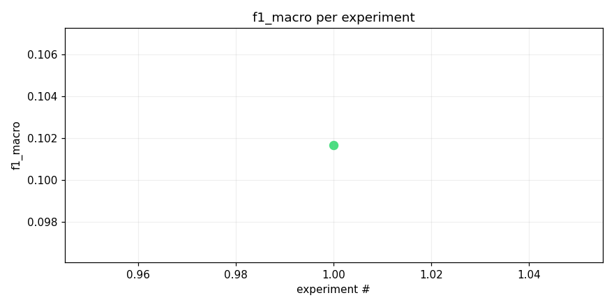
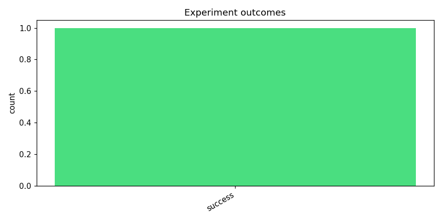
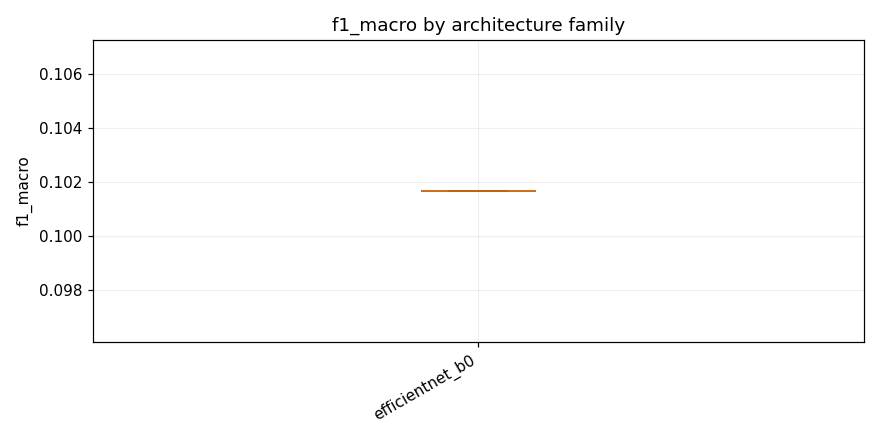

# Test opus with local training

_Task: **track_b** · Primary metric: **f1_macro** · Status: **StudyStatus.COMPLETED**_


## Executive summary

The best model achieved an F1 macro score of 0.1017 on Track B, using an EfficientNet-B0 architecture with mixup augmentation and heavy dropout regularization. This score is notably low, suggesting that the task presents significant classification challenges—perhaps due to a large number of classes, severe class imbalance, or a substantial domain gap between training and test data. One surprising finding is that despite employing aggressive regularization strategies (heavy dropout and mixup), the model still struggled considerably, indicating that regularization alone is insufficient to address the underlying difficulty. As a next experiment, I recommend trying a larger backbone (e.g., EfficientNet-B3 or a Vision Transformer) with class-balanced sampling and progressive resizing to better capture fine-grained distinctions across categories.


## Overview

| | |
|---|---|
| Study ID | `study_20260414_125322_34bc` |
| Started | 2026-04-14 12:53:22.352910+00:00 |
| Finished | 2026-04-14 13:09:42.106907+00:00 |
| Experiments | 1 (1 succeeded, 0 failed) |
| Best f1_macro | **0.1017** |
| Predecessor | — |
| Published | no |
| Tags | opus4.6, kaggle |

## Metric trajectory






## Best experiment — `exp_8cf80f84d8`

- Architecture: **[efficientnet_b0] effnet_b0_mixup_heavy_dropout** [efficientnet_b0]
- f1_macro: **0.1017**
- Duration: 933.1 s
- Other metrics:
  - `f1_macro` = 0.1017
  - `roc_auc_macro` = nan
  - `loss` = 0.0320
  - `epoch` = 1.0000


### Architecture proposal (JSON)

```json
{
  "architecture_name": "[efficientnet_b0] effnet_b0_mixup_heavy_dropout",
  "architecture_family": "efficientnet_b0",
  "description": "EfficientNet-B0 pretrained on ImageNet with 1\u21923 channel expansion, input resized to 224\u00d7224, classifier head replaced with Dropout(0.4) \u2192 Linear(1280, 512) \u2192 ReLU \u2192 Dropout(0.3) \u2192 Linear(512, 206) with sigmoid output for multi-label classification.",
  "reasoning": "As the first experiment, EfficientNet-B0 is a strong baseline for spectrogram-based audio tasks: it transfers well from ImageNet, has ~5.3M params which is still feasible for CPU inference within 90 minutes, and generally outperforms ResNet18 and MobileNetV3 on fine-grained recognition. The heavier dropout in the head (0.4 + 0.3) guards against overfitting on the long-tail minority classes. This establishes a high-quality upper bound to compare lighter architectures against."
}
```


## Per-architecture-family breakdown



| Family | Runs | Best f1_macro | Mean f1_macro |
|---|---:|---:|---:|
| efficientnet_b0 | 1 | 0.1017 | 0.1017 |


## Failure analysis

| Error type | Count | Example message |
|---|---:|---|


## Prompt versions used

| Prompt task | File |
|---|---|
| propose_architecture | `/Users/max/Documents/Master/Courses/Advanced Predictive Analytics/Group Work/advanced-topics-in-predictive-analytics-group/config/prompts/propose_architecture/v1.yaml` |
| generate_code | `/Users/max/Documents/Master/Courses/Advanced Predictive Analytics/Group Work/advanced-topics-in-predictive-analytics-group/config/prompts/generate_code/v1.yaml` |
| analyze_result | `/Users/max/Documents/Master/Courses/Advanced Predictive Analytics/Group Work/advanced-topics-in-predictive-analytics-group/config/prompts/analyze_result/v1.yaml` |
| recover_from_error | `/Users/max/Documents/Master/Courses/Advanced Predictive Analytics/Group Work/advanced-topics-in-predictive-analytics-group/config/prompts/recover_from_error/v1.yaml` |
| executive_summary | `/Users/max/Documents/Master/Courses/Advanced Predictive Analytics/Group Work/advanced-topics-in-predictive-analytics-group/config/prompts/executive_summary/v1.yaml` |


## All experiments

| # | ID | Status | Architecture | f1_macro | Duration (s) |
|---:|---|---|---|---:|---:|
| 1 | `exp_8cf80f84d8` | ExperimentStatus.COMPLETED | [efficientnet_b0] effnet_b0_mixup_heavy_dropout | 0.1017 | 933.1 |
