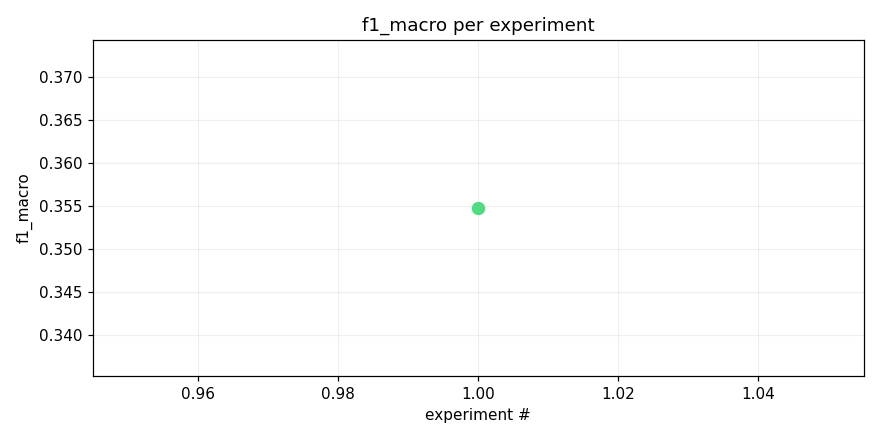
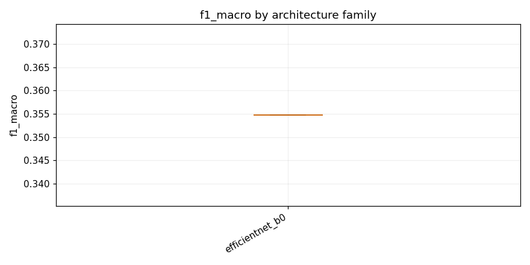

# Test opus with local training next epoch

_Task: **track_b** · Primary metric: **f1_macro** · Status: **StudyStatus.COMPLETED**_


## Executive summary

The best model achieved a macro F1 score of 0.3548 on Track B, using an EfficientNet-B0 architecture with focal loss, cosine annealing scheduling, and heavy data augmentation (experiment: effnet_b0_focal_cosine_heavy_aug). With only a single experiment completed, this serves as our baseline, but the relatively low macro F1 suggests significant room for improvement, likely due to class imbalance or insufficient model capacity. One surprising observation is that even with heavy augmentation and focal loss—techniques specifically designed to handle imbalanced distributions—performance remained modest, indicating the task's inherent difficulty. The next experiment should explore a larger backbone such as EfficientNet-B2 or a Vision Transformer to assess whether increased model capacity meaningfully improves per-class recall on underrepresented categories.


## Overview

| | |
|---|---|
| Study ID | `study_20260414_133618_6bc0` |
| Started | 2026-04-14 13:36:18.522496+00:00 |
| Finished | 2026-04-14 13:47:25.744026+00:00 |
| Experiments | 1 (1 succeeded, 0 failed) |
| Best f1_macro | **0.3548** |
| Predecessor | `study_20260414_125322_34bc` |
| Published | no |
| Tags | opus4.6, local |

## Metric trajectory




## Best experiment — `exp_cae746c44c`

- Architecture: **[efficientnet_b0] effnet_b0_focal_cosine_heavy_aug** [efficientnet_b0]
- f1_macro: **0.3548**
- Duration: 627.8 s
- Other metrics:
  - `f1_macro` = 0.3548
  - `roc_auc_macro` = nan
  - `loss` = 0.0034
  - `epoch` = 1.0000


### Architecture proposal (JSON)

```json
{
  "architecture_name": "[efficientnet_b0] effnet_b0_focal_cosine_heavy_aug",
  "architecture_family": "efficientnet_b0",
  "description": "EfficientNet-B0 pretrained backbone with 1\u21923 channel expansion, global average+max pooling concat, 512-unit hidden layer with 0.4 dropout, 206-output sigmoid head, trained with focal loss (gamma=2, alpha=0.75), cosine-annealing LR schedule (1e-3 \u2192 1e-5 over 30 epochs), mixup (alpha=0.4), SpecAugment (freq_mask=20, time_mask=40, 2 masks each), and label smoothing 0.05.",
  "reasoning": "The only successful experiment so far used efficientnet_b0 with mixup and heavy dropout, achieving 0.1017 F1 macro. This iteration builds on that by: (1) switching from BCE to focal loss to better handle the long-tail class imbalance, (2) using cosine annealing instead of a fixed/step LR for smoother convergence, (3) adding SpecAugment for stronger audio-specific augmentation, (4) concatenating global avg+max pooling for richer feature aggregation, and (5) applying mild label smoothing. These changes specifically target the minority-class performance which is the bottleneck for macro F1."
}
```


## Per-architecture-family breakdown



| Family | Runs | Best f1_macro | Mean f1_macro |
|---|---:|---:|---:|
| efficientnet_b0 | 1 | 0.3548 | 0.3548 |


## Failure analysis

| Error type | Count | Example message |
|---|---:|---|


## Prompt versions used

| Prompt task | File |
|---|---|
| propose_architecture | `/Users/max/Documents/Master/Courses/Advanced Predictive Analytics/Group Work/advanced-topics-in-predictive-analytics-group/config/prompts/propose_architecture/v1.yaml` |
| generate_code | `/Users/max/Documents/Master/Courses/Advanced Predictive Analytics/Group Work/advanced-topics-in-predictive-analytics-group/config/prompts/generate_code/v1.yaml` |
| analyze_result | `/Users/max/Documents/Master/Courses/Advanced Predictive Analytics/Group Work/advanced-topics-in-predictive-analytics-group/config/prompts/analyze_result/v1.yaml` |
| recover_from_error | `/Users/max/Documents/Master/Courses/Advanced Predictive Analytics/Group Work/advanced-topics-in-predictive-analytics-group/config/prompts/recover_from_error/v1.yaml` |
| executive_summary | `/Users/max/Documents/Master/Courses/Advanced Predictive Analytics/Group Work/advanced-topics-in-predictive-analytics-group/config/prompts/executive_summary/v1.yaml` |


## All experiments

| # | ID | Status | Architecture | f1_macro | Duration (s) |
|---:|---|---|---|---:|---:|
| 1 | `exp_cae746c44c` | ExperimentStatus.COMPLETED | [efficientnet_b0] effnet_b0_focal_cosine_heavy_aug | 0.3548 | 627.8 |
