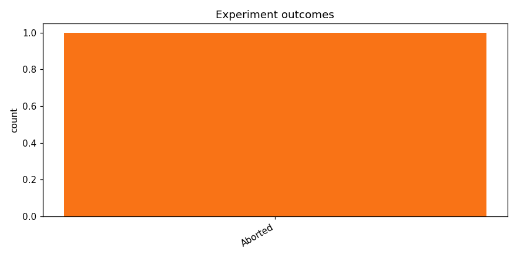

# Test opus with kaggle training

_Task: **track_b** · Primary metric: **f1_macro** · Status: **StudyStatus.ABORTED**_

## Executive summary

**Executive Summary**

No model achieved a successful run on Track B, with the best macro F1 score standing at 0.0000 across the single attempted experiment, which failed during execution. The most surprising takeaway is that even a single baseline experiment could not complete successfully, suggesting fundamental issues with the data pipeline, environment configuration, or task formulation rather than mere model underperformance. This underscores the importance of robust infrastructure validation before iterating on model architectures. As a concrete next step, we recommend running a minimal end-to-end diagnostic experiment—using a simple logistic regression or majority-class baseline—with verbose logging enabled to isolate the exact failure point before attempting more complex approaches.

## Overview

| | |
|---|---|
| Study ID | `study_20260414_152808_78fa` |
| Started | 2026-04-14 15:28:08.050292+00:00 |
| Finished | 2026-04-14 15:38:31.569574+00:00 |
| Experiments | 1 (0 succeeded, 1 failed) |
| Best f1_macro | **—** |
| Predecessor | — |
| Published | no |
| Tags | opus4.6, kaggle |

## Metric trajectory

## Per-architecture-family breakdown

| Family | Runs | Best f1_macro | Mean f1_macro |
|---|---:|---:|---:|

## Failure analysis

| Error type | Count | Example message |
|---|---:|---|
| Aborted | 1 | `User requested abort` |

## Prompt versions used

| Prompt task | File |
|---|---|
| propose_architecture | `/Users/max/Documents/Master/Courses/Advanced Predictive Analytics/Group Work/advanced-topics-in-predictive-analytics-group/config/prompts/propose_architecture/v1.yaml` |
| generate_code | `/Users/max/Documents/Master/Courses/Advanced Predictive Analytics/Group Work/advanced-topics-in-predictive-analytics-group/config/prompts/generate_code/v1.yaml` |
| analyze_result | `/Users/max/Documents/Master/Courses/Advanced Predictive Analytics/Group Work/advanced-topics-in-predictive-analytics-group/config/prompts/analyze_result/v1.yaml` |
| recover_from_error | `/Users/max/Documents/Master/Courses/Advanced Predictive Analytics/Group Work/advanced-topics-in-predictive-analytics-group/config/prompts/recover_from_error/v1.yaml` |
| executive_summary | `/Users/max/Documents/Master/Courses/Advanced Predictive Analytics/Group Work/advanced-topics-in-predictive-analytics-group/config/prompts/executive_summary/v1.yaml` |

## All experiments

| # | ID | Status | Architecture | f1_macro | Duration (s) |
|---:|---|---|---|---:|---:|
| 1 | `exp_d02e713d12` | ExperimentStatus.ABORTED | [efficientnet_b0] effnet_b0_mixup_heavy_dropout | — | 599.4 |
