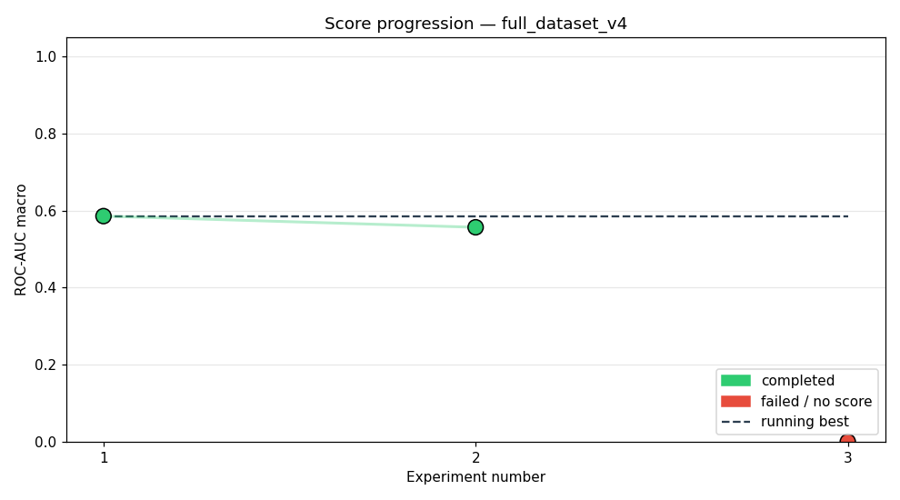
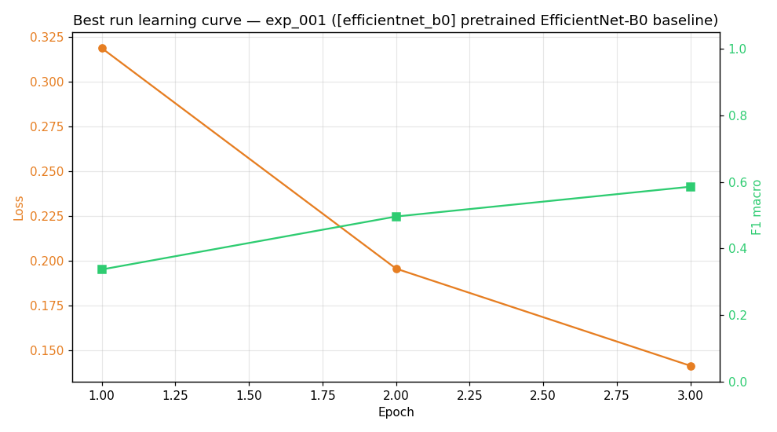
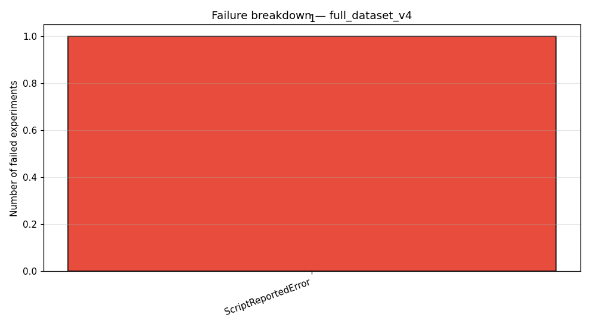

# Study: full\_dataset\_v4

## Executive Summary
The agent successfully completed two out of three planned experiments, achieving a peak ROC-AUC of 0.5858 with the EfficientNet-B0 baseline. The failure in the third experiment, `exp_003`, was due to a Python `ValueError`, indicating brittle script execution rather than inherent model weakness. Overall performance suggests that established, pretrained architectures are robust for this task, provided the experimental pipeline is stabilized.

## Methodology
The agent was tasked with optimizing performance on the `full_dataset_v4` dataset across 3 planned experiments. The study employed the `config/pipelines/default_pipeline.yaml`, utilizing a workflow that included 4 epochs per run, with a total compute budget allocated for 3 experiments, amounting to 480 min wallclock. The agent was driven by an LLM interface to manage the iterative process, attempting up to 5 recovery attempts per run. The pipeline involved comparing established architectures, including EfficientNet-B0 and MobileNet-V3 Small.

## Results

The overall success rate was moderate, with one experiment failing outright. The best achieved score was an ROC-AUC of 0.5858 in `exp_001`. The delta from the first successful run (`exp_001`) to the best run (`exp_001`) was 0.0000, as it was the best run.

| Exp | Status | Architecture | ROC-AUC |
| :--- | :--- | :--- | :--- |
| exp_001 | completed | [efficientnet_b0] pretrained EfficientNet-B0 baseline | 0.5858 |
| exp_002 | completed | [mobilenet_v3_small] MobileNet-V3 Small via TorchvisionAdapt | 0.5568 |
| exp_003 | failed | [cnn_attention] 4-Conv block front-end (32->64->128) -> Temp | — |

## Best Experiment
The best performing experiment was `exp_001`, utilizing the [efficientnet_b0] pretrained EfficientNet-B0 baseline. The optimal hyperparameters were determined to be `{'lr': 0.001, 'batch_size': 128, 'epochs': 4, 'optimizer': 'adam', 'weight_decay': 0.0, 'dropout': 0.1}`. The success of this run is attributed to the use of a well-established, pretrained feature extractor combined with stable training parameters. The learning curve confirms convergence: .

## Failure Analysis

The single recorded failure, `exp_003`, was categorized as a `ScriptReportedError`. This specific error, `ValueError: not enough values to unpack (expected 4, got 3)`, points to a fundamental brittleness within the data handling or model input serialization layer of the pipeline for custom attention blocks. It suggests potential mismatches between the expected dimensionality of the output tensor and the actual tensor shape generated by the custom 4-Conv block front-end.

## Lessons Learned
*   **Pretrained Models are Robust:** Architectures like EfficientNet-B0 provide a strong, reliable baseline performance, suggesting feature extraction from large pre-trained corpuses is highly beneficial.
*   **Pipeline Brittleness:** The failure in `exp_003` demonstrates that custom architectural components (like the attention block) require rigorous, explicit shape validation to prevent runtime `ValueError` exceptions.
*   **Hyperparameter Stability:** The successful convergence across the 4 epochs for `exp_001` indicates that the chosen hyperparameters (`lr=0.001`, `batch_size=128`) are stable for the pretrained backbone on this dataset.
*   **Error Logging Granularity:** Future monitoring must capture the exact input tensors and shapes immediately preceding a script failure to debug dimensionality mismatches efficiently.

## Next Steps
We would prioritize stabilizing the pipeline by wrapping all custom architectural blocks (like the `cnn_attention` block) with exhaustive input/output shape assertions. Furthermore, we would extend the study to systematically vary the learning rate and weight decay parameters around the successful `exp_001` settings to fine-tune performance gains beyond the established baseline.
