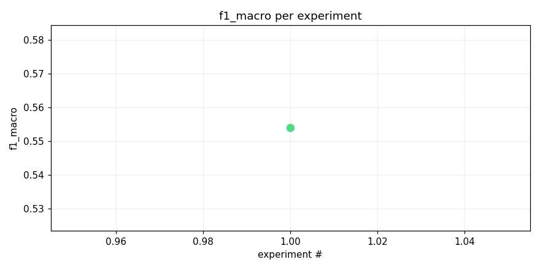
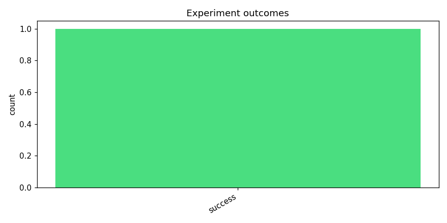
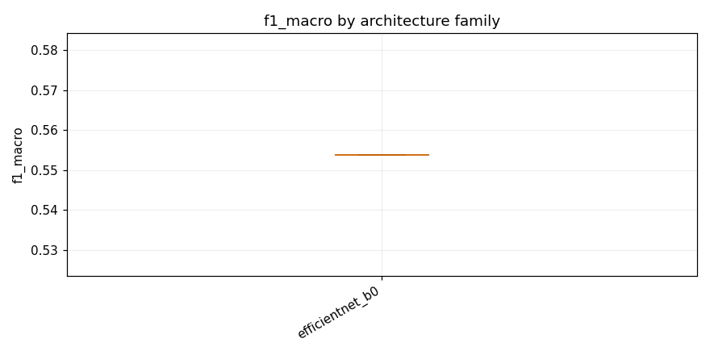

# Test opus with kaggle training

_Task: **track_b** · Primary metric: **f1_macro** · Status: **StudyStatus.COMPLETED**_


## Overview

| | |
|---|---|
| Study ID | `study_20260415_084405_4985` |
| Started | 2026-04-15 08:44:05.320295+00:00 |
| Finished | 2026-04-15 09:05:29.751955+00:00 |
| Experiments | 1 (1 succeeded, 0 failed) |
| Best f1_macro | **0.5539** |
| Predecessor | — |
| Published | no |
| Tags | opus4.6, kaggle, gpu |

## Metric trajectory






## Best experiment — `exp_848f47dab1`

- Architecture: **[efficientnet_b0] efficientnet_b0_mixup_focal** [efficientnet_b0]
- f1_macro: **0.5539**
- Duration: 1250.6 s
- Other metrics:
  - `f1_macro` = 0.5539
  - `roc_auc_macro` = —
  - `loss` = 0.0015
  - `epoch` = 1.0000


### Best experiment — epoch-wise metrics

| Epoch | Loss | f1_macro | roc_auc_macro |
|---:|---:|---:|---:|

| 1 | 0.0015 | 0.5539 | — |


### Architecture proposal (JSON)

```json
{
  "architecture_name": "[efficientnet_b0] efficientnet_b0_mixup_focal",
  "architecture_family": "efficientnet_b0",
  "description": "EfficientNet-B0 with ImageNet pretrained weights, 1\u21923 channel expansion via conv1x1, input resized to 224x224, classifier head replaced with Dropout(0.3)\u2192Linear(1280,206) trained with focal loss and mixup augmentation to handle the long-tail class imbalance.",
  "reasoning": "As the first experiment, EfficientNet-B0 is the strongest pretrained backbone that still fits within the 90-minute CPU inference budget (~5.3M params). It consistently outperforms ResNet18 and MobileNetV3-small on audio spectrogram tasks. Using focal loss and mixup specifically targets the long-tail minority class problem stated in the task description. Starting with the best expected baseline gives us a strong reference point for subsequent experiments."
}
```


## Per-architecture-family breakdown



| Family | Runs | Best f1_macro | Mean f1_macro |
|---|---:|---:|---:|
| efficientnet_b0 | 1 | 0.5539 | 0.5539 |


## Failure analysis

| Error type | Count | Example message |
|---|---:|---|


## Pipeline diagnostics

| Task | Runs | Completed | Failed | Avg validator attempts |
|---|---:|---:|---:|---:|
| capture_metrics | 1 | 1 | 0 | — |
| execute_training | 1 | 1 | 0 | — |
| generate_code | 1 | 1 | 0 | — |
| propose_architecture | 1 | 1 | 0 | — |


## Prompt versions used

| Prompt task | File |
|---|---|
| propose_architecture | `/Users/max/Documents/Master/Courses/Advanced Predictive Analytics/Group Work/advanced-topics-in-predictive-analytics-group/config/prompts/propose_architecture/v1.yaml` |
| generate_code | `/Users/max/Documents/Master/Courses/Advanced Predictive Analytics/Group Work/advanced-topics-in-predictive-analytics-group/config/prompts/generate_code/v1.yaml` |
| analyze_result | `/Users/max/Documents/Master/Courses/Advanced Predictive Analytics/Group Work/advanced-topics-in-predictive-analytics-group/config/prompts/analyze_result/v1.yaml` |
| recover_from_error | `/Users/max/Documents/Master/Courses/Advanced Predictive Analytics/Group Work/advanced-topics-in-predictive-analytics-group/config/prompts/recover_from_error/v1.yaml` |
| executive_summary | `/Users/max/Documents/Master/Courses/Advanced Predictive Analytics/Group Work/advanced-topics-in-predictive-analytics-group/config/prompts/executive_summary/v1.yaml` |


## All experiments

| # | ID | Status | Architecture | f1_macro | Duration (s) |
|---:|---|---|---|---:|---:|
| 1 | `exp_848f47dab1` | ExperimentStatus.COMPLETED | [efficientnet_b0] efficientnet_b0_mixup_focal | 0.5539 | 1250.6 |
