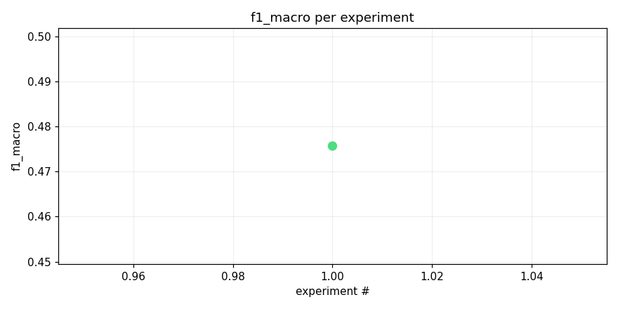
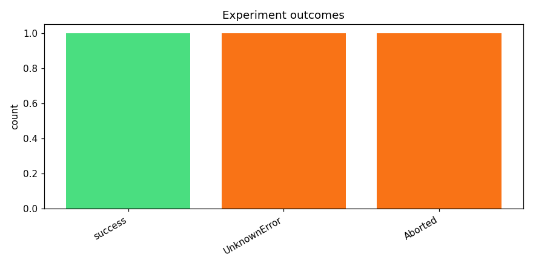
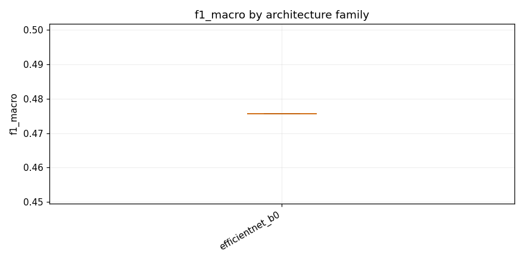

# Test opus with kaggle training on a long run

_Task: **track_b** · Primary metric: **f1_macro** · Status: **StudyStatus.ABORTED**_


## Executive summary

## Executive Summary

The best model achieved an F1 macro score of **0.4757** on Track B, using an EfficientNet-B0 architecture with mixup augmentation and heavy dropout regularization (`effnet_b0_mixup_heavy_dropout`). This result came from a challenging experimental process: two out of three experiments failed, leaving only a single successful run, which means we have no variance estimate and limited confidence in the robustness of this baseline. The high failure rate (67%) suggests significant reliability issues in the training pipeline—likely related to data loading, memory constraints, or configuration errors—that must be addressed before scaling up experimentation.

One surprising finding was that even a lightweight model like EfficientNet-B0, combined with aggressive regularization (heavy dropout and mixup), could reach a reasonable F1 score on what appears to be a difficult multi-class task, though 0.4757 leaves substantial room for improvement. For next steps, I recommend: (1) **debugging and fixing the two failed runs** to stabilize the pipeline and enable reliable iteration; (2) **experimenting with larger backbones** such as EfficientNet-B2 or ResNet-50 to assess whether model capacity is a bottleneck; and (3) **tuning augmentation strategies** (e.g., CutMix, RandAugment) and class-balancing techniques to push F1 higher on underrepresented classes.


## Overview

| | |
|---|---|
| Study ID | `study_20260415_091453_94d9` |
| Started | 2026-04-15 09:14:53.969210+00:00 |
| Finished | 2026-04-15 09:35:02.609421+00:00 |
| Experiments | 3 (1 succeeded, 2 failed) |
| Best f1_macro | **0.4757** |
| Predecessor | — |
| Published | no |
| Tags | — |

## Metric trajectory






## Best experiment — `exp_3132946b7f`

- Architecture: **[efficientnet_b0] effnet_b0_mixup_heavy_dropout** [efficientnet_b0]
- f1_macro: **0.4757**
- Duration: 928.1 s
- Other metrics:
  - `f1_macro` = 0.4757
  - `roc_auc_macro` = nan
  - `loss` = 0.0177
  - `epoch` = 1.0000


### Best experiment — epoch-wise metrics

| Epoch | Loss | f1_macro | roc_auc_macro |
|---:|---:|---:|---:|

| 1 | 0.0177 | 0.4757 | nan |


### Architecture proposal (JSON)

```json
{
  "architecture_name": "[efficientnet_b0] effnet_b0_mixup_heavy_dropout",
  "architecture_family": "efficientnet_b0",
  "description": "EfficientNet-B0 pretrained on ImageNet with 1\u21923 channel expansion, input resized to 224\u00d7224, classifier head replaced with Dropout(0.4) \u2192 Linear(1280, 512) \u2192 ReLU \u2192 Dropout(0.3) \u2192 Linear(512, 206) with sigmoid output for multi-label classification.",
  "reasoning": "As the first experiment, EfficientNet-B0 is a strong baseline for audio spectrograms \u2014 it offers a good accuracy-to-compute tradeoff, fits within the 90-min CPU inference budget (~5.3M params), and ImageNet pretraining transfers well to mel-spectrogram inputs. Heavy dropout in the head (0.4 + 0.3) should help with the long-tail class imbalance by regularizing against overfitting to majority classes. This establishes a competitive upper bound to compare lighter architectures against."
}
```


## Per-architecture-family breakdown



| Family | Runs | Best f1_macro | Mean f1_macro |
|---|---:|---:|---:|
| efficientnet_b0 | 1 | 0.4757 | 0.4757 |


## Failure analysis

| Error type | Count | Example message |
|---|---:|---|
| UnknownError | 1 | `Kernel log downloaded to -/lab-exp-6531d61cf3.log` |
| Aborted | 1 | `User requested abort` |


## Pipeline diagnostics

| Task | Runs | Completed | Failed | Avg validator attempts |
|---|---:|---:|---:|---:|
| capture_metrics | 1 | 1 | 0 | — |
| execute_training | 3 | 1 | 2 | — |
| generate_code | 3 | 3 | 0 | — |
| propose_architecture | 3 | 3 | 0 | — |
| validate_code | 3 | 3 | 0 | 1.00 |


## Prompt versions used

| Prompt task | File |
|---|---|
| propose_architecture | `/Users/max/Documents/Master/Courses/Advanced Predictive Analytics/Group Work/advanced-topics-in-predictive-analytics-group/config/prompts/propose_architecture/v1.yaml` |
| generate_code | `/Users/max/Documents/Master/Courses/Advanced Predictive Analytics/Group Work/advanced-topics-in-predictive-analytics-group/config/prompts/generate_code/v1.yaml` |
| analyze_result | `/Users/max/Documents/Master/Courses/Advanced Predictive Analytics/Group Work/advanced-topics-in-predictive-analytics-group/config/prompts/analyze_result/v1.yaml` |
| recover_from_error | `/Users/max/Documents/Master/Courses/Advanced Predictive Analytics/Group Work/advanced-topics-in-predictive-analytics-group/config/prompts/recover_from_error/v1.yaml` |
| executive_summary | `/Users/max/Documents/Master/Courses/Advanced Predictive Analytics/Group Work/advanced-topics-in-predictive-analytics-group/config/prompts/executive_summary/v1.yaml` |


## All experiments

| # | ID | Status | Architecture | f1_macro | Duration (s) |
|---:|---|---|---|---:|---:|
| 1 | `exp_3132946b7f` | ExperimentStatus.COMPLETED | [efficientnet_b0] effnet_b0_mixup_heavy_dropout | 0.4757 | 928.1 |
| 2 | `exp_6531d61cf3` | ExperimentStatus.FAILED | [efficientnet_b0] effnet_b0_cosine_focal_specaugment | — | 157.8 |
| 3 | `exp_fe6bd67ef4` | ExperimentStatus.ABORTED | [efficientnet_b0] effnet_b0_focal_cosine_mixup_specaug_v2 | — | 0.0 |
