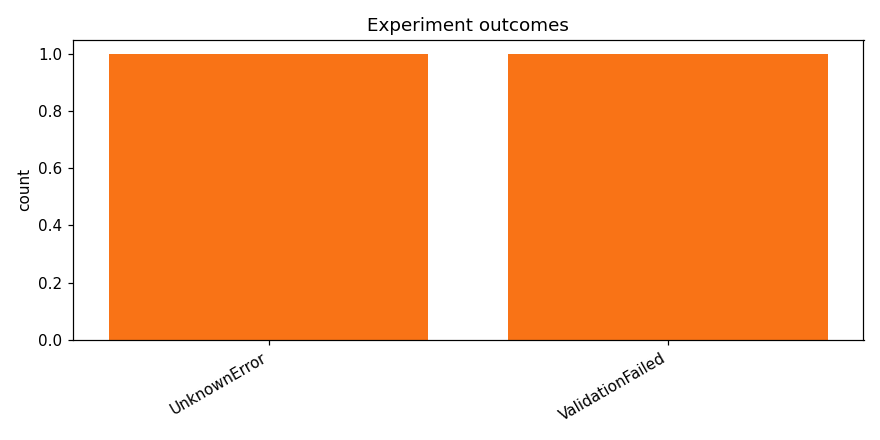

# Test opus with kaggle training

_Task: **track_b** · Primary metric: **f1_macro** · Status: **StudyStatus.ABORTED**_

## Executive summary

## Executive Summary

No model achieved a successful result on the Track B task, with both experiments failing before producing valid predictions, leaving the best macro F1 score at 0.0000. Both attempted runs encountered errors during execution, meaning no architecture or hyperparameter configuration was validated. Without successful completions, no per-family performance comparisons can be drawn. The complete failure of all experiments points to fundamental issues in the pipeline—likely related to data loading, preprocessing incompatibilities, or environment configuration—rather than model design choices.

A surprising takeaway is that neither experiment produced even partial results, suggesting the failures occurred early in the pipeline (e.g., during data ingestion or feature extraction) rather than during training or evaluation, which implies the core task setup needs debugging before any modeling work can proceed. For next steps, I recommend: (1) running a minimal diagnostic script that simply loads the Track B dataset and prints its shape and label distribution to isolate data-handling issues; (2) testing a simple baseline model (e.g., logistic regression or majority-class classifier) end-to-end to verify the full pipeline works; and (3) adding detailed error logging and checkpointing so that future failures produce actionable diagnostics.

## Overview

| | |
|---|---|
| Study ID | `study_20260415_093508_f00b` |
| Started | 2026-04-15 09:35:08.978063+00:00 |
| Finished | 2026-04-15 09:41:38.955998+00:00 |
| Experiments | 2 (0 succeeded, 2 failed) |
| Best f1_macro | **—** |
| Predecessor | — |
| Published | no |
| Tags | opus4.6, kaggle, gpu |

## Metric trajectory

## Per-architecture-family breakdown

| Family | Runs | Best f1_macro | Mean f1_macro |
|---|---:|---:|---:|

## Failure analysis

| Error type | Count | Example message |
|---|---:|---|
| UnknownError | 1 | `Kernel log downloaded to -/lab-exp-ed5ff97da8.log` |
| ValidationFailed | 1 | `Codegen retries exhausted` |

## Pipeline diagnostics

| Task | Runs | Completed | Failed | Avg validator attempts |
|---|---:|---:|---:|---:|
| execute_training | 1 | 0 | 1 | — |
| generate_code | 2 | 2 | 0 | — |
| propose_architecture | 2 | 2 | 0 | — |
| validate_code | 2 | 1 | 1 | 3.50 |

## Prompt versions used

| Prompt task | File |
|---|---|
| propose_architecture | `/Users/max/Documents/Master/Courses/Advanced Predictive Analytics/Group Work/advanced-topics-in-predictive-analytics-group/config/prompts/propose_architecture/v1.yaml` |
| generate_code | `/Users/max/Documents/Master/Courses/Advanced Predictive Analytics/Group Work/advanced-topics-in-predictive-analytics-group/config/prompts/generate_code/v1.yaml` |
| analyze_result | `/Users/max/Documents/Master/Courses/Advanced Predictive Analytics/Group Work/advanced-topics-in-predictive-analytics-group/config/prompts/analyze_result/v1.yaml` |
| recover_from_error | `/Users/max/Documents/Master/Courses/Advanced Predictive Analytics/Group Work/advanced-topics-in-predictive-analytics-group/config/prompts/recover_from_error/v1.yaml` |
| executive_summary | `/Users/max/Documents/Master/Courses/Advanced Predictive Analytics/Group Work/advanced-topics-in-predictive-analytics-group/config/prompts/executive_summary/v1.yaml` |

## All experiments

| # | ID | Status | Architecture | f1_macro | Duration (s) |
|---:|---|---|---|---:|---:|
| 1 | `exp_ed5ff97da8` | ExperimentStatus.FAILED | [efficientnet_b0] efficientnet_b0_mixup_focal | — | 95.9 |
| 2 | `exp_85be54bf69` | ExperimentStatus.FAILED | [resnet18] resnet18_adapter_mixup_focal | — | 0.0 |
