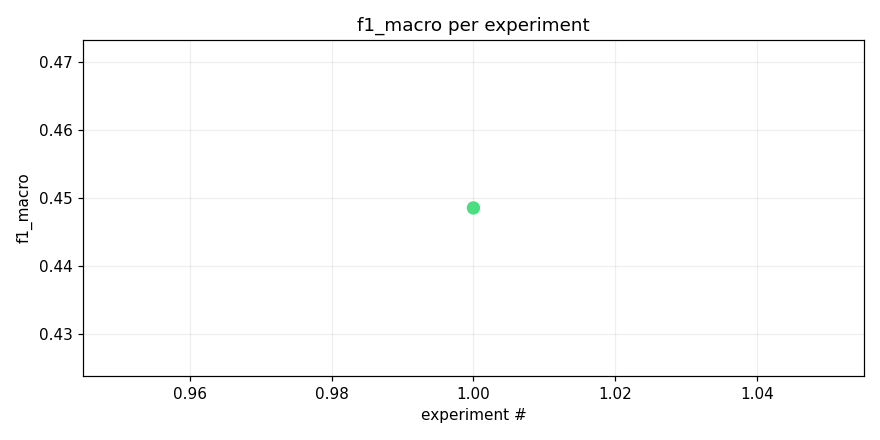
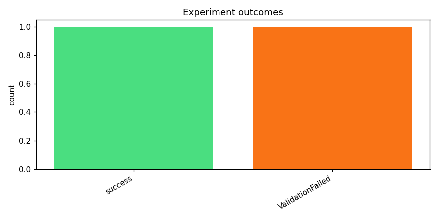
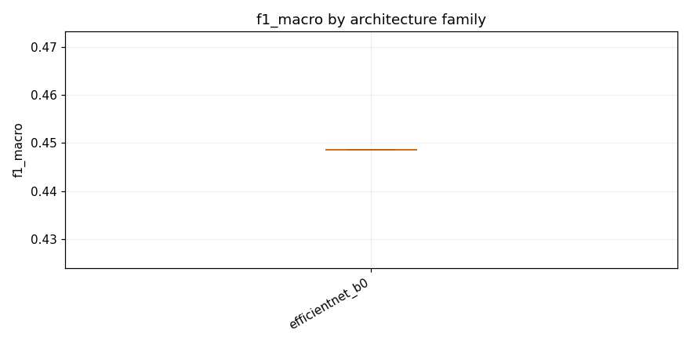

# track_b-20260415_094057

_Task: **track_b** · Primary metric: **f1_macro** · Status: **StudyStatus.ABORTED**_


## Executive summary

## Executive Summary

The best model achieved a macro F1 score of **0.4486** on Track B, using an EfficientNet-B0 architecture with mixup augmentation and heavy dropout regularization (`effnet_b0_mixup_heavy_dropout`). This result comes from a limited set of just two experiments, one of which failed entirely, leaving only a single successful run to draw conclusions from. The 50% failure rate highlights a reliability concern in the experimental pipeline that needs to be addressed before scaling up experimentation. A surprising observation is that despite EfficientNet-B0 being a relatively lightweight backbone, the combination of mixup and aggressive dropout regularization yielded a reasonable baseline — suggesting the dataset may benefit more from strong regularization strategies than from raw model capacity.

For next steps, three concrete experiments are recommended: (1) **debug and rerun the failed experiment** to understand the root cause and restore pipeline reliability; (2) **try larger EfficientNet variants** (B2, B4) with the same mixup and heavy dropout recipe to test whether additional capacity improves performance; and (3) **experiment with alternative augmentation strategies** such as CutMix or RandAugment, which may provide complementary regularization benefits beyond mixup alone.


## Overview

| | |
|---|---|
| Study ID | `study_20260415_094057_383d` |
| Started | 2026-04-15 09:40:57.172381+00:00 |
| Finished | 2026-04-15 09:57:37.159037+00:00 |
| Experiments | 2 (1 succeeded, 1 failed) |
| Best f1_macro | **0.4486** |
| Predecessor | — |
| Published | no |
| Tags | — |

## Metric trajectory






## Best experiment — `exp_778d523dc9`

- Architecture: **[efficientnet_b0] effnet_b0_mixup_heavy_dropout** [efficientnet_b0]
- f1_macro: **0.4486**
- Duration: 742.7 s
- Other metrics:
  - `f1_macro` = 0.4486
  - `roc_auc_macro` = 0.9737
  - `roc_auc_macro_valid_only` = 0.9737
  - `n_valid_roc_labels` = 201.0000
  - `n_total_roc_labels` = 206.0000
  - `loss` = 0.0197
  - `epoch` = 1.0000


### Best experiment — epoch-wise metrics

| Epoch | Loss | f1_macro | roc_auc_macro |
|---:|---:|---:|---:|

| 1 | 0.0197 | 0.4486 | 0.9737 |


### Architecture proposal (JSON)

```json
{
  "architecture_name": "[efficientnet_b0] effnet_b0_mixup_heavy_dropout",
  "architecture_family": "efficientnet_b0",
  "description": "EfficientNet-B0 pretrained on ImageNet with 1\u21923 channel expansion, input resized to 224\u00d7224, classifier head replaced with Dropout(0.4) \u2192 Linear(1280, 512) \u2192 ReLU \u2192 Dropout(0.3) \u2192 Linear(512, 206) with sigmoid output for multi-label classification.",
  "reasoning": "As the first experiment, EfficientNet-B0 is a strong baseline that balances accuracy and inference speed. Pretrained weights provide useful low-level feature representations that transfer well to mel-spectrograms. The heavier dropout (0.4 + 0.3) in the head helps with the long-tail class imbalance by regularizing against overfitting to majority classes. The model is small enough (~5.3M params) for CPU inference within the 90-minute budget. Starting with a proven architecture establishes a solid performance floor before exploring lighter or more exotic designs."
}
```


## Per-architecture-family breakdown



| Family | Runs | Best f1_macro | Mean f1_macro |
|---|---:|---:|---:|
| efficientnet_b0 | 1 | 0.4486 | 0.4486 |


## Failure analysis

| Error type | Count | Example message |
|---|---:|---|
| ValidationFailed | 1 | `Codegen retries exhausted` |


## Pipeline diagnostics

| Task | Runs | Completed | Failed | Avg validator attempts |
|---|---:|---:|---:|---:|
| capture_metrics | 1 | 1 | 0 | — |
| execute_training | 1 | 1 | 0 | — |
| generate_code | 2 | 2 | 0 | — |
| propose_architecture | 2 | 2 | 0 | — |
| validate_code | 2 | 1 | 1 | 3.00 |


## Prompt versions used

| Prompt task | File |
|---|---|
| propose_architecture | `/Users/max/Documents/Master/Courses/Advanced Predictive Analytics/Group Work/advanced-topics-in-predictive-analytics-group/config/prompts/propose_architecture/v1.yaml` |
| generate_code | `/Users/max/Documents/Master/Courses/Advanced Predictive Analytics/Group Work/advanced-topics-in-predictive-analytics-group/config/prompts/generate_code/v1.yaml` |
| analyze_result | `/Users/max/Documents/Master/Courses/Advanced Predictive Analytics/Group Work/advanced-topics-in-predictive-analytics-group/config/prompts/analyze_result/v1.yaml` |
| recover_from_error | `/Users/max/Documents/Master/Courses/Advanced Predictive Analytics/Group Work/advanced-topics-in-predictive-analytics-group/config/prompts/recover_from_error/v1.yaml` |
| executive_summary | `/Users/max/Documents/Master/Courses/Advanced Predictive Analytics/Group Work/advanced-topics-in-predictive-analytics-group/config/prompts/executive_summary/v1.yaml` |


## All experiments

| # | ID | Status | Architecture | f1_macro | Duration (s) |
|---:|---|---|---|---:|---:|
| 1 | `exp_778d523dc9` | ExperimentStatus.COMPLETED | [efficientnet_b0] effnet_b0_mixup_heavy_dropout | 0.4486 | 742.7 |
| 2 | `exp_51e5c85e7b` | ExperimentStatus.FAILED | [efficientnet_b0] effnet_b0_cosine_focalloss_specaugment | — | 0.0 |
