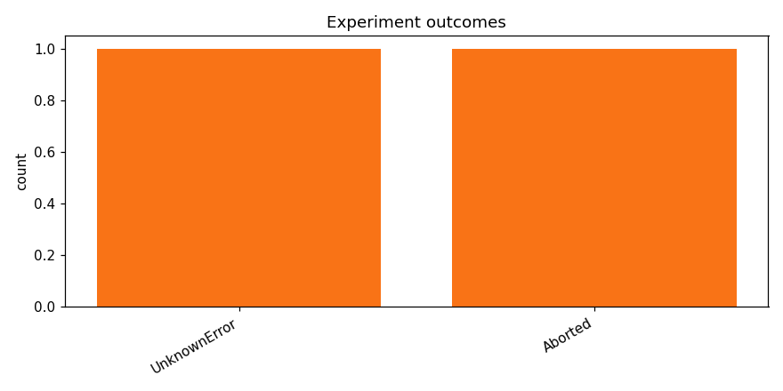

# Test opus with kaggle training

_Task: **track_b** · Primary metric: **f1_macro** · Status: **StudyStatus.ABORTED**_

## Overview

| | |
|---|---|
| Study ID | `study_20260415_095507_b52f` |
| Started | 2026-04-15 09:55:07.575517+00:00 |
| Finished | 2026-04-15 09:59:52.972838+00:00 |
| Experiments | 2 (0 succeeded, 2 failed) |
| Best f1_macro | **—** |
| Predecessor | — |
| Published | no |
| Tags | opus4.6, kaggle, gpu |

## Metric trajectory

## Per-architecture-family breakdown

| Family | Runs | Best f1_macro | Mean f1_macro |
|---|---:|---:|---:|

## Failure analysis

| Error type | Count | Example message |
|---|---:|---|
| UnknownError | 1 | `]` |
| Aborted | 1 | `User requested abort` |

## Pipeline diagnostics

| Task | Runs | Completed | Failed | Avg validator attempts |
|---|---:|---:|---:|---:|
| execute_training | 2 | 0 | 2 | — |
| generate_code | 2 | 2 | 0 | — |
| propose_architecture | 2 | 2 | 0 | — |
| validate_code | 2 | 2 | 0 | 1.00 |

## Prompt versions used

| Prompt task | File |
|---|---|
| propose_architecture | `/Users/max/Documents/Master/Courses/Advanced Predictive Analytics/Group Work/advanced-topics-in-predictive-analytics-group/config/prompts/propose_architecture/v1.yaml` |
| generate_code | `/Users/max/Documents/Master/Courses/Advanced Predictive Analytics/Group Work/advanced-topics-in-predictive-analytics-group/config/prompts/generate_code/v1.yaml` |
| analyze_result | `/Users/max/Documents/Master/Courses/Advanced Predictive Analytics/Group Work/advanced-topics-in-predictive-analytics-group/config/prompts/analyze_result/v1.yaml` |
| recover_from_error | `/Users/max/Documents/Master/Courses/Advanced Predictive Analytics/Group Work/advanced-topics-in-predictive-analytics-group/config/prompts/recover_from_error/v1.yaml` |
| executive_summary | `/Users/max/Documents/Master/Courses/Advanced Predictive Analytics/Group Work/advanced-topics-in-predictive-analytics-group/config/prompts/executive_summary/v1.yaml` |

## All experiments

| # | ID | Status | Architecture | f1_macro | Duration (s) |
|---:|---|---|---|---:|---:|
| 1 | `exp_67e05accfd` | ExperimentStatus.FAILED | specaugment_cnn_small | — | 96.2 |
| 2 | `exp_c2802957e8` | ExperimentStatus.ABORTED | mobilenet_v3_small_adapter | — | 115.2 |
