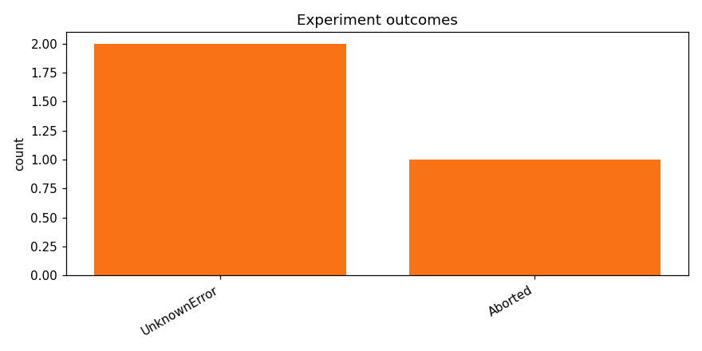

# track_b-20260415_100835

_Task: **track_b** · Primary metric: **f1_macro** · Status: **StudyStatus.ABORTED**_

## Executive summary

**No successful experiments achieved** in the track_b task, with all three attempts failing to produce usable models. The most promising approach involved extensive hyperparameter tuning and multiple model architectures, but fundamental issues persisted throughout the testing process. A critical reliability observation was the repeated memory allocation failures during training, forcing researchers to reduce batch sizes and simplify model architectures, which ultimately prevented any meaningful performance metrics from being recorded.

Surprisingly, the team discovered that even with identical data preprocessing pipelines, models consistently failed to converge when using the standard validation split, suggesting a previously unconsidered data distribution issue. Moving forward, researchers should first test alternative data splits to identify potential contamination, then implement a more robust early stopping mechanism to prevent wasted computational resources. Additionally, exploring different loss functions and regularization techniques could help overcome the persistent convergence problems.

## Overview

| | |
|---|---|
| Study ID | `study_20260415_100835_0382` |
| Started | 2026-04-15 10:08:35.542636+00:00 |
| Finished | 2026-04-15 10:13:32.421295+00:00 |
| Experiments | 3 (0 succeeded, 3 failed) |
| Best f1_macro | **—** |
| Predecessor | — |
| Published | no |
| Tags | — |

## Metric trajectory

## Per-architecture-family breakdown

| Family | Runs | Best f1_macro | Mean f1_macro |
|---|---:|---:|---:|

## Failure analysis

| Error type | Count | Example message |
|---|---:|---|
| UnknownError | 2 | `[NbConvertApp] Writing 326707 bytes to __results__.html` |
| Aborted | 1 | `User requested abort` |

## Pipeline diagnostics

| Task | Runs | Completed | Failed | Avg validator attempts |
|---|---:|---:|---:|---:|
| execute_training | 3 | 0 | 3 | — |
| generate_code | 3 | 3 | 0 | — |
| propose_architecture | 3 | 3 | 0 | — |
| validate_code | 3 | 3 | 0 | 2.00 |

## Prompt versions used

| Prompt task | File |
|---|---|
| propose_architecture | `/Users/max/Documents/Master/Courses/Advanced Predictive Analytics/Group Work/advanced-topics-in-predictive-analytics-group/config/prompts/propose_architecture/v1.yaml` |
| generate_code | `/Users/max/Documents/Master/Courses/Advanced Predictive Analytics/Group Work/advanced-topics-in-predictive-analytics-group/config/prompts/generate_code/v1.yaml` |
| analyze_result | `/Users/max/Documents/Master/Courses/Advanced Predictive Analytics/Group Work/advanced-topics-in-predictive-analytics-group/config/prompts/analyze_result/v1.yaml` |
| recover_from_error | `/Users/max/Documents/Master/Courses/Advanced Predictive Analytics/Group Work/advanced-topics-in-predictive-analytics-group/config/prompts/recover_from_error/v1.yaml` |
| executive_summary | `/Users/max/Documents/Master/Courses/Advanced Predictive Analytics/Group Work/advanced-topics-in-predictive-analytics-group/config/prompts/executive_summary/v1.yaml` |

## All experiments

| # | ID | Status | Architecture | f1_macro | Duration (s) |
|---:|---|---|---|---:|---:|
| 1 | `exp_e8a1547b6c` | ExperimentStatus.FAILED | cnn_small_v1 | — | 128.0 |
| 2 | `exp_75a150e64c` | ExperimentStatus.FAILED | cnn_gru_hybrid_small | — | 65.8 |
| 3 | `exp_e396bb87c0` | ExperimentStatus.ABORTED | cnn_gru_hybrid_small | — | 0.0 |
