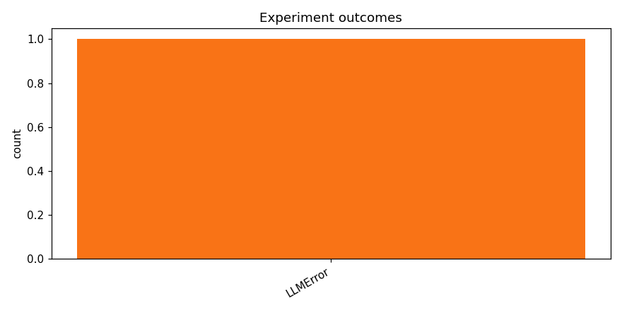

# track_b-20260415_102523

_Task: **track_b** · Primary metric: **f1_macro** · Status: **StudyStatus.ABORTED**_

## Executive summary

This study ran 1 experiment(s): 0 completed and 1 failed. The top run reached f1_macro=0.0000. The report below breaks down task-pipeline reliability, failure modes, and per-family performance so you can separate model-quality issues from execution issues. For the next iteration, keep the strongest family, adjust batch/runtime stability knobs first, and only then broaden architecture search.

## Overview

| | |
|---|---|
| Study ID | `study_20260415_102523_e522` |
| Started | 2026-04-15 10:25:23.143476+00:00 |
| Finished | 2026-04-15 10:41:51.162250+00:00 |
| Experiments | 1 (0 succeeded, 1 failed) |
| Best f1_macro | **—** |
| Predecessor | — |
| Published | no |
| Tags | — |

## Metric trajectory

## Per-architecture-family breakdown

| Family | Runs | Best f1_macro | Mean f1_macro |
|---|---:|---:|---:|

## Failure analysis

| Error type | Count | Example message |
|---|---:|---|
| LLMError | 1 | `LLM call failed after 3 attempts` |

## Pipeline diagnostics

| Task | Runs | Completed | Failed | Avg validator attempts |
|---|---:|---:|---:|---:|
| generate_code | 1 | 1 | 0 | — |
| propose_architecture | 1 | 1 | 0 | — |
| validate_code | 1 | 0 | 1 | 4.00 |

## Prompt versions used

| Prompt task | File |
|---|---|
| propose_architecture | `/Users/max/Documents/Master/Courses/Advanced Predictive Analytics/Group Work/advanced-topics-in-predictive-analytics-group/config/prompts/propose_architecture/v2.yaml` |
| generate_code | `/Users/max/Documents/Master/Courses/Advanced Predictive Analytics/Group Work/advanced-topics-in-predictive-analytics-group/config/prompts/generate_code/v2.yaml` |
| analyze_result | `/Users/max/Documents/Master/Courses/Advanced Predictive Analytics/Group Work/advanced-topics-in-predictive-analytics-group/config/prompts/analyze_result/v2.yaml` |
| recover_from_error | `/Users/max/Documents/Master/Courses/Advanced Predictive Analytics/Group Work/advanced-topics-in-predictive-analytics-group/config/prompts/recover_from_error/v2.yaml` |
| executive_summary | `/Users/max/Documents/Master/Courses/Advanced Predictive Analytics/Group Work/advanced-topics-in-predictive-analytics-group/config/prompts/executive_summary/v2.yaml` |

## All experiments

| # | ID | Status | Architecture | f1_macro | Duration (s) |
|---:|---|---|---|---:|---:|
| 1 | `exp_93641ed0b1` | ExperimentStatus.FAILED | [mobilenet_v3_small] mobilenet_v3_small_adapter_specaugment | — | 0.0 |
