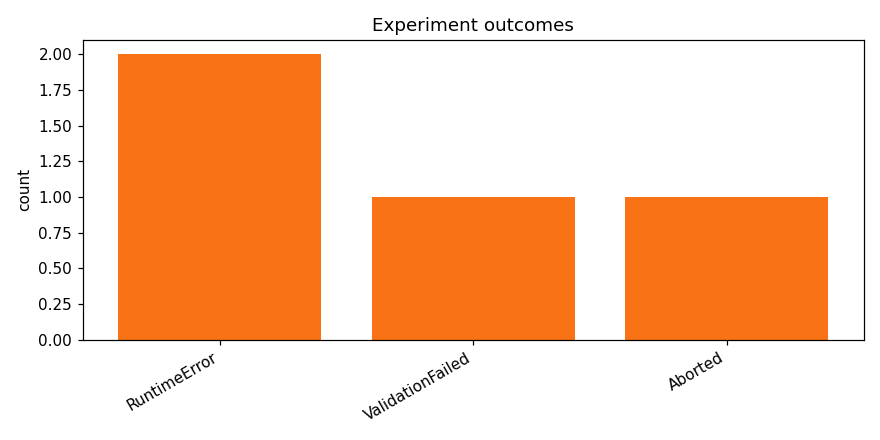

# track_b-20260415_103200

_Task: **track_b** · Primary metric: **f1_macro** · Status: **StudyStatus.ABORTED**_

## Overview

| | |
|---|---|
| Study ID | `study_20260415_103200_709c` |
| Started | 2026-04-15 10:32:00.619840+00:00 |
| Finished | 2026-04-15 10:48:23.371399+00:00 |
| Experiments | 4 (0 succeeded, 4 failed) |
| Best f1_macro | **—** |
| Predecessor | — |
| Published | no |
| Tags | — |

## Metric trajectory

## Per-architecture-family breakdown

| Family | Runs | Best f1_macro | Mean f1_macro |
|---|---:|---:|---:|

## Failure analysis

| Error type | Count | Example message |
|---|---:|---|
| RuntimeError | 2 | `RuntimeError: Can't call numpy() on Tensor that requires grad. Use tensor.detach().numpy() instead.` |
| ValidationFailed | 1 | `Codegen retries exhausted` |
| Aborted | 1 | `User requested abort` |

## Pipeline diagnostics

| Task | Runs | Completed | Failed | Avg validator attempts |
|---|---:|---:|---:|---:|
| execute_training | 3 | 0 | 3 | — |
| generate_code | 4 | 4 | 0 | — |
| propose_architecture | 4 | 4 | 0 | — |
| validate_code | 4 | 3 | 1 | 3.25 |

## Prompt versions used

| Prompt task | File |
|---|---|
| propose_architecture | `/Users/max/Documents/Master/Courses/Advanced Predictive Analytics/Group Work/advanced-topics-in-predictive-analytics-group/config/prompts/propose_architecture/v2.yaml` |
| generate_code | `/Users/max/Documents/Master/Courses/Advanced Predictive Analytics/Group Work/advanced-topics-in-predictive-analytics-group/config/prompts/generate_code/v2.yaml` |
| analyze_result | `/Users/max/Documents/Master/Courses/Advanced Predictive Analytics/Group Work/advanced-topics-in-predictive-analytics-group/config/prompts/analyze_result/v2.yaml` |
| recover_from_error | `/Users/max/Documents/Master/Courses/Advanced Predictive Analytics/Group Work/advanced-topics-in-predictive-analytics-group/config/prompts/recover_from_error/v2.yaml` |
| executive_summary | `/Users/max/Documents/Master/Courses/Advanced Predictive Analytics/Group Work/advanced-topics-in-predictive-analytics-group/config/prompts/executive_summary/v2.yaml` |

## All experiments

| # | ID | Status | Architecture | f1_macro | Duration (s) |
|---:|---|---|---|---:|---:|
| 1 | `exp_0bc73a0150` | ExperimentStatus.FAILED | [custom_cnn] cnn_small_v1_dropout | — | 65.8 |
| 2 | `exp_982f21b0e7` | ExperimentStatus.FAILED | [mobilenet_v3_small] mobilenet_v3_small_adapter | — | 0.0 |
| 3 | `exp_12c611f9c2` | ExperimentStatus.FAILED | [efficientnet_b0] efficientnet_b0_mixup_dp_safe | — | 96.2 |
| 4 | `exp_51bb53c4e4` | ExperimentStatus.ABORTED | [custom_cnn] cnn_small_v2 | — | 0.0 |
