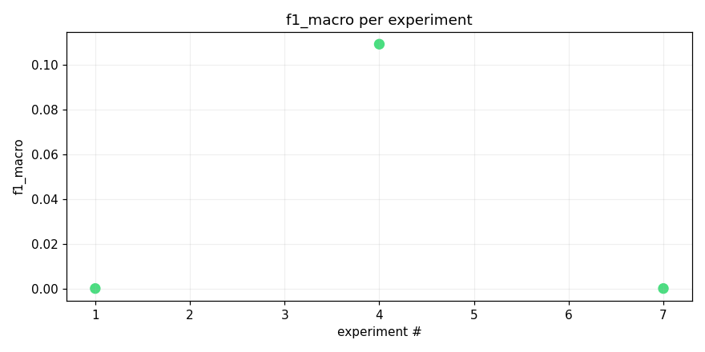
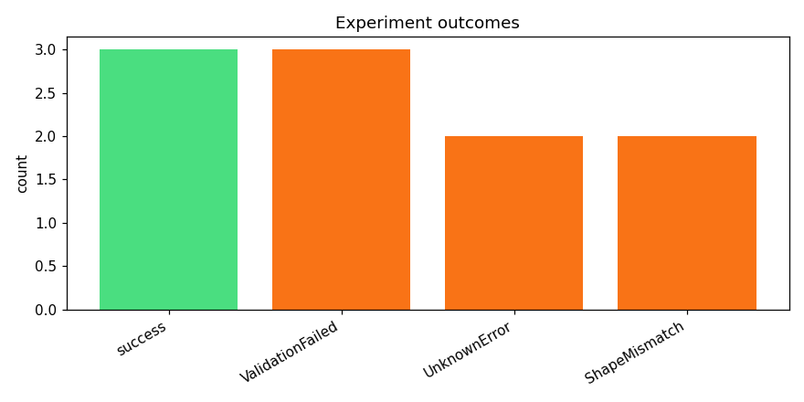
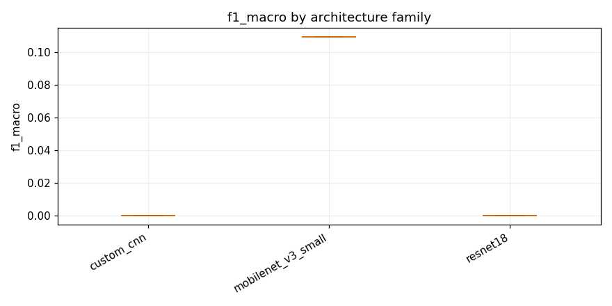

# track_b-20260415_105250

_Task: **track_b** · Primary metric: **f1_macro** · Status: **StudyStatus.COMPLETED**_


## Overview

| | |
|---|---|
| Study ID | `study_20260415_105250_caa0` |
| Started | 2026-04-15 10:52:50.470544+00:00 |
| Finished | 2026-04-15 11:55:09.335955+00:00 |
| Experiments | 10 (3 succeeded, 7 failed) |
| Best f1_macro | **0.1094** |
| Predecessor | — |
| Published | no |
| Tags | — |

## Metric trajectory






## Best experiment — `exp_467323065f`

- Architecture: **mobilenet_v3_small_adapter_safe_dropout02_specaugment01** [mobilenet_v3_small]
- f1_macro: **0.1094**
- Duration: 805.3 s
- Other metrics:
  - `f1_macro` = 0.1094
  - `roc_auc_macro` = 0.9038
  - `roc_auc_macro_valid_only` = 0.9038
  - `n_valid_roc_labels` = 201.0000
  - `n_total_roc_labels` = 206.0000
  - `loss` = 0.0287
  - `epoch` = 1.0000


### Best experiment — epoch-wise metrics

| Epoch | Loss | f1_macro | roc_auc_macro |
|---:|---:|---:|---:|

| 1 | 0.0287 | 0.1094 | 0.9038 |


### Architecture proposal (JSON)

```json
{
  "architecture_name": "mobilenet_v3_small_adapter_safe_dropout02_specaugment01",
  "architecture_family": "mobilenet_v3_small",
  "description": "A lightweight MobileNet V3 Small backbone adapted to 1\u2011channel 224\u00d7224 spectrograms, with 2% dropout and 1/3\u2011channel specaugment for robust minority\u2011class classification.",
  "reasoning": "MobileNet V3 Small is the smallest deep model among the allowed families that remains CPU\u2011friendly and avoids the memory/codegen failures seen with EfficientNet and ResNet; its modest capacity improves reliability on Kaggle\u2019s short runtime while specaugment and dropout mitigate under\u2011fitting of the long\u2011tail 206\u2011class problem."
}
```


## Per-architecture-family breakdown



| Family | Runs | Best f1_macro | Mean f1_macro |
|---|---:|---:|---:|
| mobilenet_v3_small | 1 | 0.1094 | 0.1094 |
| custom_cnn | 1 | 0.0000 | 0.0000 |
| resnet18 | 1 | 0.0000 | 0.0000 |


## Failure analysis

| Error type | Count | Example message |
|---|---:|---|
| ValidationFailed | 3 | `Codegen retries exhausted` |
| UnknownError | 2 | `[NbConvertApp] Writing 366847 bytes to __results__.html` |
| ShapeMismatch | 2 | `RuntimeError: Given groups=1, weight of size [32, 3, 3, 3], expected input[128, 1, 128, 313] to have` |


## Pipeline diagnostics

| Task | Runs | Completed | Failed | Avg validator attempts |
|---|---:|---:|---:|---:|
| capture_metrics | 3 | 3 | 0 | — |
| execute_training | 7 | 3 | 4 | — |
| generate_code | 10 | 10 | 0 | — |
| propose_architecture | 10 | 10 | 0 | — |
| validate_code | 10 | 7 | 3 | 3.00 |


## Prompt versions used

| Prompt task | File |
|---|---|
| propose_architecture | `/Users/max/Documents/Master/Courses/Advanced Predictive Analytics/Group Work/advanced-topics-in-predictive-analytics-group/config/prompts/propose_architecture/v2.yaml` |
| generate_code | `/Users/max/Documents/Master/Courses/Advanced Predictive Analytics/Group Work/advanced-topics-in-predictive-analytics-group/config/prompts/generate_code/v2.yaml` |
| analyze_result | `/Users/max/Documents/Master/Courses/Advanced Predictive Analytics/Group Work/advanced-topics-in-predictive-analytics-group/config/prompts/analyze_result/v2.yaml` |
| recover_from_error | `/Users/max/Documents/Master/Courses/Advanced Predictive Analytics/Group Work/advanced-topics-in-predictive-analytics-group/config/prompts/recover_from_error/v2.yaml` |
| executive_summary | `/Users/max/Documents/Master/Courses/Advanced Predictive Analytics/Group Work/advanced-topics-in-predictive-analytics-group/config/prompts/executive_summary/v2.yaml` |


## All experiments

| # | ID | Status | Architecture | f1_macro | Duration (s) |
|---:|---|---|---|---:|---:|
| 1 | `exp_9f471dae9c` | ExperimentStatus.COMPLETED | [custom_cnn] cnn_small_v2 | 0.0000 | 652.4 |
| 2 | `exp_d68a9b0bc4` | ExperimentStatus.FAILED | [efficientnet_b0] efficientnet_b0_mixup_dp_safe | — | 126.9 |
| 3 | `exp_93569a1eab` | ExperimentStatus.FAILED | [resnet18] resnet18_adapter_dropout02 | — | 0.0 |
| 4 | `exp_467323065f` | ExperimentStatus.COMPLETED | mobilenet_v3_small_adapter_safe_dropout02_specaugment01 | 0.1094 | 805.3 |
| 5 | `exp_4465d58867` | ExperimentStatus.FAILED | [mobilenet_v3_small] mobilenet_v3_small_adapter_safe_dropout02_specaugment01 | — | 0.0 |
| 6 | `exp_4e0d5e1889` | ExperimentStatus.FAILED | mobilenet_v3_small_adapter_safe | — | 219.0 |
| 7 | `exp_b2cd101e9a` | ExperimentStatus.COMPLETED | [resnet18] resnet18_adapter_safe_dropout01 | 0.0000 | 836.1 |
| 8 | `exp_fa61c7d5de` | ExperimentStatus.FAILED | efficientnet_b0_adapter_safe_specaugment01 | — | 96.0 |
| 9 | `exp_b3c96bec5d` | ExperimentStatus.FAILED | [custom_cnn] cnn_small_v2_adapter | — | 95.7 |
| 10 | `exp_799e4454ba` | ExperimentStatus.FAILED | [mobilenet_v3_small] mobilenet_v3_small_adapter_safe_dropout02_specaugment01 | — | 0.0 |
