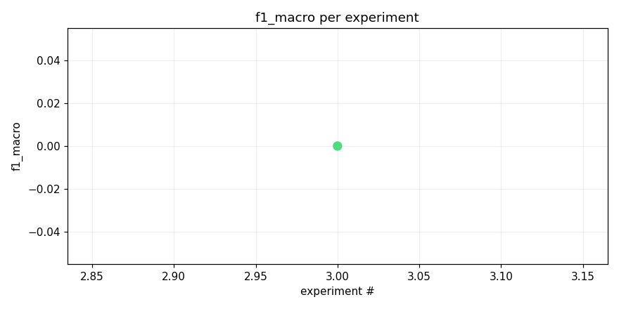
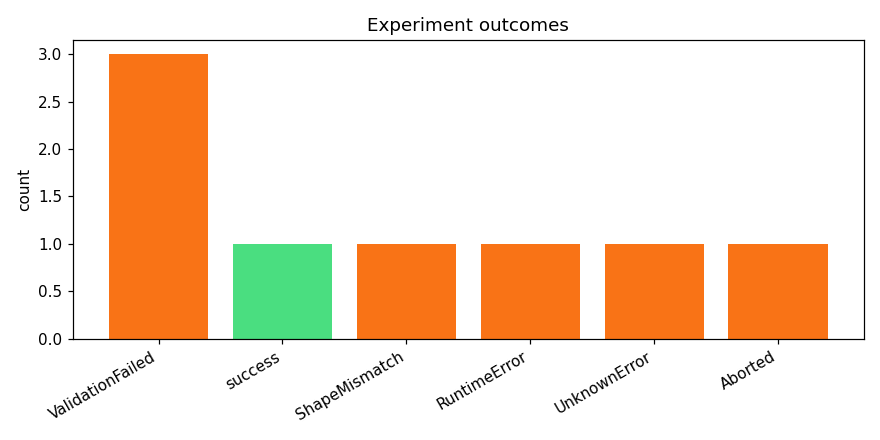
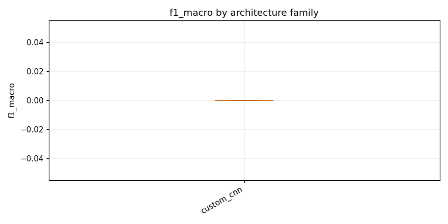

# track_b-20260415_111826

_Task: **track_b** · Primary metric: **f1_macro** · Status: **StudyStatus.ABORTED**_


## Overview

| | |
|---|---|
| Study ID | `study_20260415_111826_2394` |
| Started | 2026-04-15 11:18:26.655779+00:00 |
| Finished | 2026-04-15 12:04:46.219060+00:00 |
| Experiments | 8 (1 succeeded, 7 failed) |
| Best f1_macro | **0.0000** |
| Predecessor | `study_20260415_094057_383d` |
| Published | no |
| Tags | — |

## Metric trajectory






## Best experiment — `exp_d680ec8c75`

- Architecture: **[custom_cnn] cnn_small_v1** [custom_cnn]
- f1_macro: **0.0000**
- Duration: 804.6 s
- Other metrics:
  - `f1_macro` = 0.0000
  - `roc_auc_macro` = 0.5446
  - `roc_auc_macro_valid_only` = 0.5446
  - `n_valid_roc_labels` = 201.0000
  - `n_total_roc_labels` = 206.0000
  - `loss` = 0.2768
  - `epoch` = 1.0000


### Best experiment — epoch-wise metrics

| Epoch | Loss | f1_macro | roc_auc_macro |
|---:|---:|---:|---:|

| 1 | 0.2768 | 0.0000 | 0.5446 |


### Architecture proposal (JSON)

```json
{
  "architecture_name": "[custom_cnn] cnn_small_v1",
  "architecture_family": "custom_cnn",
  "description": "A lightweight 3\u2011layer CNN with batch\u2011norm, adaptive global pooling, and a dense multi\u2011label head, optimized for stable CPU inference.",
  "reasoning": "Given previous failures with larger backbones and mixed\u2011up augmentations, we revert to the smallest proven baseline [custom_cnn] cnn_small_v1, which uses only safe ops, no dropout or mixup, and a simple 3\u2011conv\u2011block architecture (7\u00d77, 3\u00d73, 1\u00d71 kernels) yielding ~800k parameters, avoiding codegen retries; risk is low capacity but mitigated by conservative hyper\u2011parameters and CPU\u2011only pipeline."
}
```


## Per-architecture-family breakdown



| Family | Runs | Best f1_macro | Mean f1_macro |
|---|---:|---:|---:|
| custom_cnn | 1 | 0.0000 | 0.0000 |


## Failure analysis

| Error type | Count | Example message |
|---|---:|---|
| ValidationFailed | 3 | `Codegen retries exhausted` |
| ShapeMismatch | 1 | `RuntimeError: Given groups=1, weight of size [64, 3, 7, 7], expected input[128, 1, 128, 313] to have` |
| RuntimeError | 1 | `RuntimeError: Caught RuntimeError in replica 0 on device 0.` |
| UnknownError | 1 | `[NbConvertApp] Writing 364871 bytes to __results__.html` |
| Aborted | 1 | `User requested abort` |


## Pipeline diagnostics

| Task | Runs | Completed | Failed | Avg validator attempts |
|---|---:|---:|---:|---:|
| capture_metrics | 1 | 1 | 0 | — |
| execute_training | 5 | 1 | 4 | — |
| generate_code | 8 | 8 | 0 | — |
| propose_architecture | 8 | 8 | 0 | — |
| validate_code | 8 | 5 | 3 | 3.25 |


## Prompt versions used

| Prompt task | File |
|---|---|
| propose_architecture | `/Users/max/Documents/Master/Courses/Advanced Predictive Analytics/Group Work/advanced-topics-in-predictive-analytics-group/config/prompts/propose_architecture/v2.yaml` |
| generate_code | `/Users/max/Documents/Master/Courses/Advanced Predictive Analytics/Group Work/advanced-topics-in-predictive-analytics-group/config/prompts/generate_code/v2.yaml` |
| analyze_result | `/Users/max/Documents/Master/Courses/Advanced Predictive Analytics/Group Work/advanced-topics-in-predictive-analytics-group/config/prompts/analyze_result/v2.yaml` |
| recover_from_error | `/Users/max/Documents/Master/Courses/Advanced Predictive Analytics/Group Work/advanced-topics-in-predictive-analytics-group/config/prompts/recover_from_error/v2.yaml` |
| executive_summary | `/Users/max/Documents/Master/Courses/Advanced Predictive Analytics/Group Work/advanced-topics-in-predictive-analytics-group/config/prompts/executive_summary/v2.yaml` |


## All experiments

| # | ID | Status | Architecture | f1_macro | Duration (s) |
|---:|---|---|---|---:|---:|
| 1 | `exp_3007828616` | ExperimentStatus.FAILED | [resnet18] resnet18_adapter_1x3x224 | — | 0.0 |
| 2 | `exp_721551234c` | ExperimentStatus.FAILED | [efficientnet_b0] efficientnet_b0_mixup_safe | — | 0.0 |
| 3 | `exp_d680ec8c75` | ExperimentStatus.COMPLETED | [custom_cnn] cnn_small_v1 | 0.0000 | 804.6 |
| 4 | `exp_a6b5f1382e` | ExperimentStatus.FAILED | [mobilenet_v3_small] mv3s_small_aug | — | 0.0 |
| 5 | `exp_385cfac532` | ExperimentStatus.FAILED | [resnet18] resnet18_adapter_fp | — | 96.0 |
| 6 | `exp_9b39c224cf` | ExperimentStatus.FAILED | [efficientnet_b0] effnet_b0_mixup_dp_safe | — | 127.2 |
| 7 | `exp_1131871bd3` | ExperimentStatus.FAILED | [mobilenet_v3_small] mb_small_adv | — | 158.0 |
| 8 | `exp_9ea94e9de0` | ExperimentStatus.ABORTED | [resnet18] resnet18_adapter_dp_safe | — | 885.1 |
