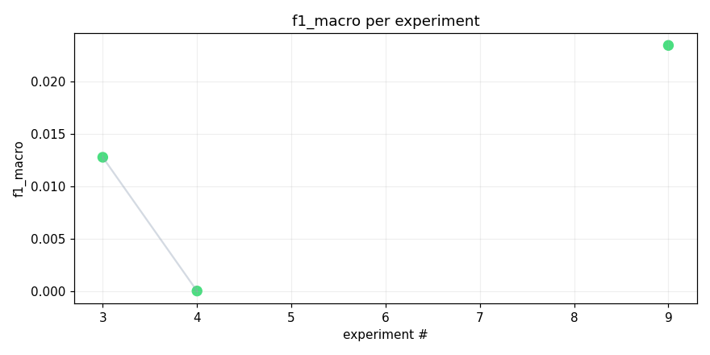
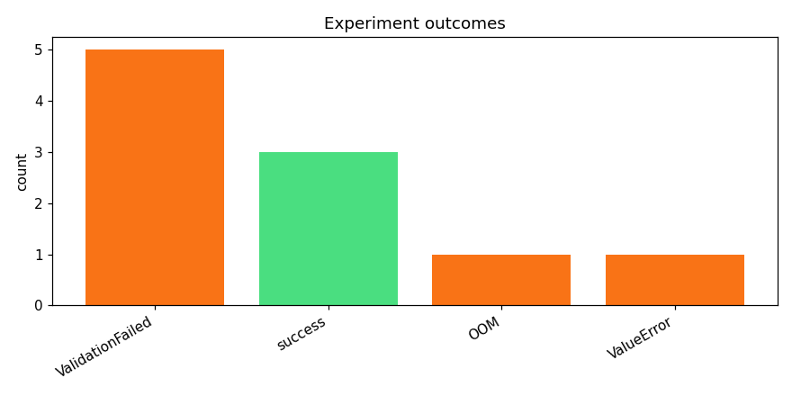
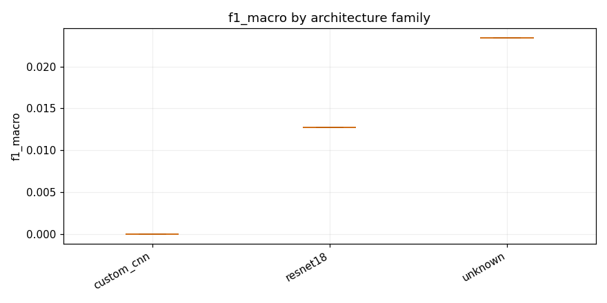

# track_b-20260415_151652

_Task: **track_b** · Primary metric: **f1_macro** · Status: **StudyStatus.COMPLETED**_


## Overview

| | |
|---|---|
| Study ID | `study_20260415_151652_f8bf` |
| Started | 2026-04-15 15:16:52.080858+00:00 |
| Finished | 2026-04-15 16:22:50.920865+00:00 |
| Experiments | 10 (3 succeeded, 7 failed) |
| Best f1_macro | **0.0234** |
| Predecessor | — |
| Published | no |
| Tags | — |

## Metric trajectory






## Best experiment — `exp_12ac2eab07`

- Architecture: **parse_failed** [—]
- f1_macro: **0.0234**
- Duration: 711.8 s
- Other metrics:
  - `f1_macro` = 0.0234
  - `roc_auc_macro` = 0.5655
  - `roc_auc_macro_valid_only` = 0.5655
  - `n_valid_roc_labels` = 201.0000
  - `n_total_roc_labels` = 206.0000
  - `loss` = 36.5215
  - `epoch` = 1.0000


### Best experiment — epoch-wise metrics

| Epoch | Loss | f1_macro | roc_auc_macro |
|---:|---:|---:|---:|

| 1 | 36.5215 | 0.0234 | 0.5655 |


### Architecture proposal (JSON)

```json
{
  "architecture_name": "parse_failed",
  "architecture_family": null,
  "description": "",
  "reasoning": "LLM returned non-JSON"
}
```


## Per-architecture-family breakdown



| Family | Runs | Best f1_macro | Mean f1_macro |
|---|---:|---:|---:|
| unknown | 1 | 0.0234 | 0.0234 |
| resnet18 | 1 | 0.0127 | 0.0127 |
| custom_cnn | 1 | 0.0000 | 0.0000 |


## Failure analysis

| Error type | Count | Example message |
|---|---:|---|
| ValidationFailed | 5 | `Codegen retries exhausted` |
| OOM | 1 | `torch.OutOfMemoryError: CUDA out of memory. Tried to allocate 1.22 GiB. GPU 0 has a total capacity o` |
| ValueError | 1 | `raise ValueError(` |


## Pipeline diagnostics

| Task | Runs | Completed | Failed | Avg validator attempts |
|---|---:|---:|---:|---:|
| capture_metrics | 3 | 3 | 0 | — |
| execute_training | 5 | 3 | 2 | — |
| generate_code | 10 | 10 | 0 | — |
| propose_architecture | 10 | 10 | 0 | — |
| validate_code | 10 | 5 | 5 | 3.70 |


## Prompt versions used

| Prompt task | File |
|---|---|
| propose_architecture | `/Users/max/Documents/Master/Courses/Advanced Predictive Analytics/Group Work/advanced-topics-in-predictive-analytics-group/config/prompts/propose_architecture/v2.yaml` |
| generate_code | `/Users/max/Documents/Master/Courses/Advanced Predictive Analytics/Group Work/advanced-topics-in-predictive-analytics-group/config/prompts/generate_code/v2.yaml` |
| analyze_result | `/Users/max/Documents/Master/Courses/Advanced Predictive Analytics/Group Work/advanced-topics-in-predictive-analytics-group/config/prompts/analyze_result/v2.yaml` |
| recover_from_error | `/Users/max/Documents/Master/Courses/Advanced Predictive Analytics/Group Work/advanced-topics-in-predictive-analytics-group/config/prompts/recover_from_error/v2.yaml` |
| executive_summary | `/Users/max/Documents/Master/Courses/Advanced Predictive Analytics/Group Work/advanced-topics-in-predictive-analytics-group/config/prompts/executive_summary/v2.yaml` |


## All experiments

| # | ID | Status | Architecture | f1_macro | Duration (s) |
|---:|---|---|---|---:|---:|
| 1 | `exp_da769854e2` | ExperimentStatus.FAILED | mobilenet_v3_small_adapter_dropout | — | 0.0 |
| 2 | `exp_8659bea80e` | ExperimentStatus.FAILED | [custom_cnn] cnn_small_v1_specaugment | — | 126.4 |
| 3 | `exp_40ec41db77` | ExperimentStatus.COMPLETED | [resnet18] resnet18_adapter_safe | 0.0127 | 802.5 |
| 4 | `exp_93c25919d1` | ExperimentStatus.COMPLETED | [custom_cnn] cnn_small_v1_dropout | 0.0000 | 679.8 |
| 5 | `exp_e5389ff690` | ExperimentStatus.FAILED | [efficientnet_b0] effnet_b0_adapter_dp_safe | — | 0.0 |
| 6 | `exp_e17770e5c0` | ExperimentStatus.FAILED | [mobilenet_v3_small] mobilenet_v3_small_adapter_safe | — | 403.2 |
| 7 | `exp_12138ad318` | ExperimentStatus.FAILED | [custom_cnn] cnn_small_v1_mixup_safe | — | 0.0 |
| 8 | `exp_1dedad5742` | ExperimentStatus.FAILED | [resnet18] resnet18_adapter_safe | — | 0.0 |
| 9 | `exp_12ac2eab07` | ExperimentStatus.COMPLETED | parse_failed | 0.0234 | 711.8 |
| 10 | `exp_e0de88d86c` | ExperimentStatus.FAILED | [mobilenet_v3_small] mobilenet_v3_small_dropout | — | 0.0 |
