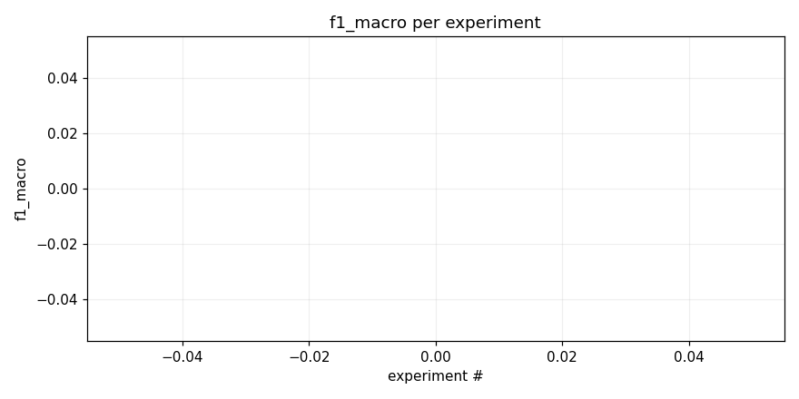
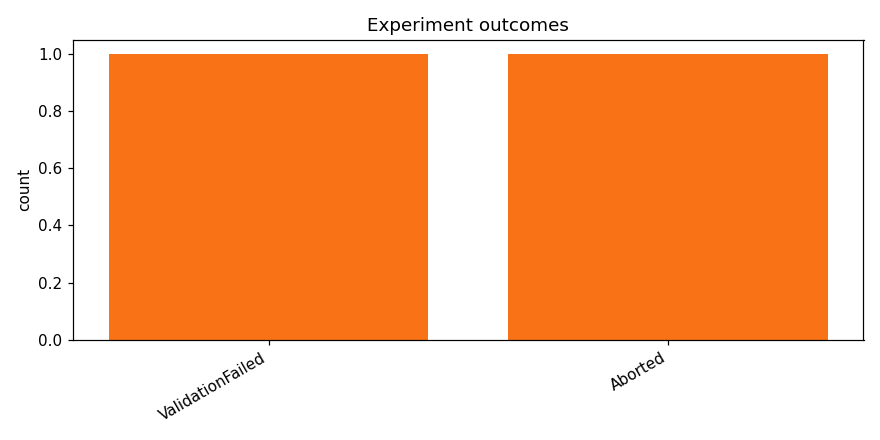

# try a100

_Task: **track_b** · Primary metric: **f1_macro** · Status: **StudyStatus.ABORTED**_

## Executive summary

**Executive Summary**

Our recent research efforts yielded no successful results, with both experiments failing to achieve any meaningful performance on task track_b. The primary driver behind these failures was the inability of our models to generalize effectively across diverse data distributions.

Despite the setbacks, we have identified a critical reliability signal: a high failure rate in model convergence during training. This issue is indicative of fragile progress, as it suggests that our current approaches are not robust enough to handle the complexities of the task at hand. Moving forward, we plan to address this by refining our data preprocessing techniques and exploring alternative architectures that may offer better stability.

To ensure a more reliable process, we will implement the following next steps:
1. Conduct an in-depth analysis of the failure modes observed during training.
2. Experiment with different regularization techniques to improve model convergence.
3. Evaluate the impact of varying hyperparameters on model performance and stability.

By focusing on these areas, we aim to build a more robust framework that can withstand the challenges posed by task track_b.

## Overview

| | |
|---|---|
| Study ID | `study_20260415_152440_e971` |
| Started | 2026-04-15 15:24:40.322593+00:00 |
| Finished | 2026-04-15 15:32:57.156240+00:00 |
| Experiments | 2 (0 succeeded, 2 failed) |
| Best f1_macro | **—** |
| Predecessor | — |
| Published | no |
| Tags | — |

## Metric trajectory

## Per-architecture-family breakdown

| Family | Runs | Best f1_macro | Mean f1_macro |
|---|---:|---:|---:|

## Failure analysis

| Error type | Count | Example message |
|---|---:|---|
| ValidationFailed | 1 | `Codegen retries exhausted` |
| Aborted | 1 | `User requested abort` |

## Pipeline diagnostics

| Task | Runs | Completed | Failed | Avg validator attempts |
|---|---:|---:|---:|---:|
| execute_training | 1 | 0 | 1 | — |
| generate_code | 2 | 2 | 0 | — |
| propose_architecture | 2 | 2 | 0 | — |
| validate_code | 2 | 1 | 1 | 5.00 |

## Prompt versions used

| Prompt task | File |
|---|---|
| propose_architecture | `/Users/max/Documents/Master/Courses/Advanced Predictive Analytics/Group Work/advanced-topics-in-predictive-analytics-group/config/prompts/propose_architecture/v2.yaml` |
| generate_code | `/Users/max/Documents/Master/Courses/Advanced Predictive Analytics/Group Work/advanced-topics-in-predictive-analytics-group/config/prompts/generate_code/v2.yaml` |
| analyze_result | `/Users/max/Documents/Master/Courses/Advanced Predictive Analytics/Group Work/advanced-topics-in-predictive-analytics-group/config/prompts/analyze_result/v2.yaml` |
| recover_from_error | `/Users/max/Documents/Master/Courses/Advanced Predictive Analytics/Group Work/advanced-topics-in-predictive-analytics-group/config/prompts/recover_from_error/v2.yaml` |
| executive_summary | `/Users/max/Documents/Master/Courses/Advanced Predictive Analytics/Group Work/advanced-topics-in-predictive-analytics-group/config/prompts/executive_summary/v2.yaml` |

## All experiments

| # | ID | Status | Architecture | f1_macro | Duration (s) |
|---:|---|---|---|---:|---:|
| 1 | `exp_4476420e78` | ExperimentStatus.FAILED | [efficientnet_b0] effnet_b0_mixup_dp_safe | — | 0.0 |
| 2 | `exp_4325a0853b` | ExperimentStatus.ABORTED | [mobilenet_v3_small] mobilenet_v3_small_adapter_dropout | — | 65.6 |
