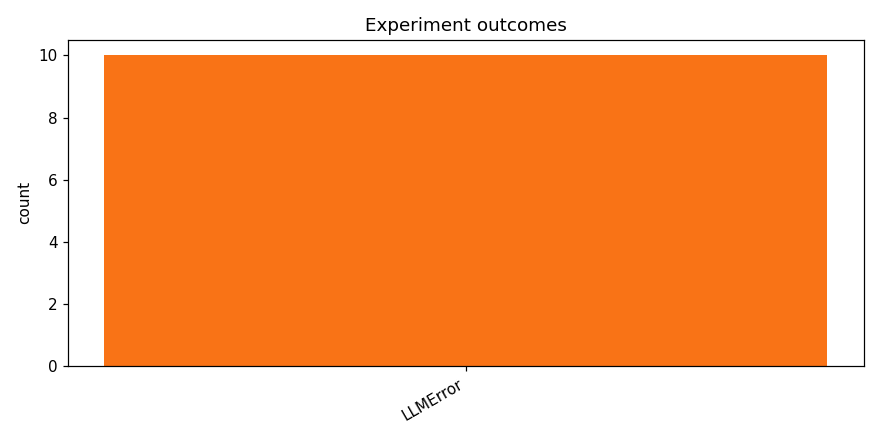

# track_b-20260415_175927

_Task: **track_b** · Primary metric: **f1_macro** · Status: **StudyStatus.FAILED**_

## Executive summary

This study ran 10 experiment(s): 0 completed and 10 failed. The top run reached f1_macro=0.0000. The report below breaks down task-pipeline reliability, failure modes, and per-family performance so you can separate model-quality issues from execution issues. For the next iteration, keep the strongest family, adjust batch/runtime stability knobs first, and only then broaden architecture search.

## Overview

| | |
|---|---|
| Study ID | `study_20260415_175927_d423` |
| Started | 2026-04-15 17:59:27.444946+00:00 |
| Finished | 2026-04-15 18:01:57.657006+00:00 |
| Experiments | 10 (0 succeeded, 10 failed) |
| Best f1_macro | **—** |
| Predecessor | — |
| Published | no |
| Tags | — |

## Metric trajectory

## Per-architecture-family breakdown

| Family | Runs | Best f1_macro | Mean f1_macro |
|---|---:|---:|---:|

## Failure analysis

| Error type | Count | Example message |
|---|---:|---|
| LLMError | 10 | `LLM call failed after 3 attempts` |

## Pipeline diagnostics

| Task | Runs | Completed | Failed | Avg validator attempts |
|---|---:|---:|---:|---:|
| propose_architecture | 10 | 0 | 10 | — |

## Prompt versions used

| Prompt task | File |
|---|---|
| propose_architecture | `/Users/max/Documents/Master/Courses/Advanced Predictive Analytics/Group Work/advanced-topics-in-predictive-analytics-group/config/prompts/propose_architecture/v2.yaml` |
| generate_code | `/Users/max/Documents/Master/Courses/Advanced Predictive Analytics/Group Work/advanced-topics-in-predictive-analytics-group/config/prompts/generate_code/v2.yaml` |
| analyze_result | `/Users/max/Documents/Master/Courses/Advanced Predictive Analytics/Group Work/advanced-topics-in-predictive-analytics-group/config/prompts/analyze_result/v2.yaml` |
| recover_from_error | `/Users/max/Documents/Master/Courses/Advanced Predictive Analytics/Group Work/advanced-topics-in-predictive-analytics-group/config/prompts/recover_from_error/v2.yaml` |
| executive_summary | `/Users/max/Documents/Master/Courses/Advanced Predictive Analytics/Group Work/advanced-topics-in-predictive-analytics-group/config/prompts/executive_summary/v2.yaml` |

## All experiments

| # | ID | Status | Architecture | f1_macro | Duration (s) |
|---:|---|---|---|---:|---:|
| 1 | `exp_5db62f4c7f` | ExperimentStatus.FAILED | — | — | 0.0 |
| 2 | `exp_c917be3737` | ExperimentStatus.FAILED | — | — | 0.0 |
| 3 | `exp_827f5da5a1` | ExperimentStatus.FAILED | — | — | 0.0 |
| 4 | `exp_17c7d2dbac` | ExperimentStatus.FAILED | — | — | 0.0 |
| 5 | `exp_7beaa0654a` | ExperimentStatus.FAILED | — | — | 0.0 |
| 6 | `exp_b2c2416572` | ExperimentStatus.FAILED | — | — | 0.0 |
| 7 | `exp_8625fec6f7` | ExperimentStatus.FAILED | — | — | 0.0 |
| 8 | `exp_4454bbe5b7` | ExperimentStatus.FAILED | — | — | 0.0 |
| 9 | `exp_9fefb414dd` | ExperimentStatus.FAILED | — | — | 0.0 |
| 10 | `exp_a0adb8bdaf` | ExperimentStatus.FAILED | — | — | 0.0 |
