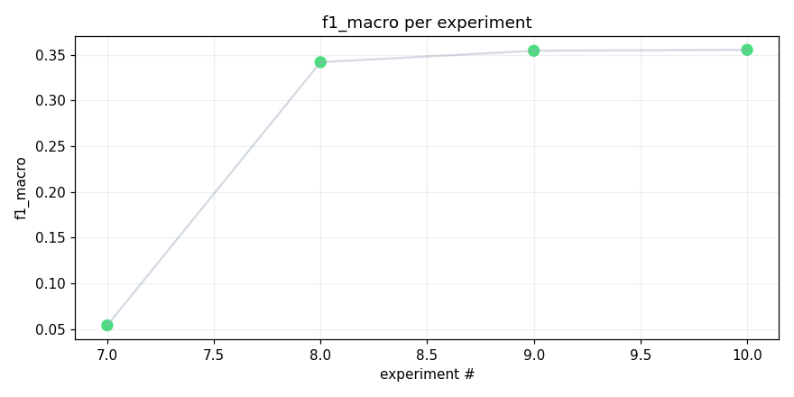
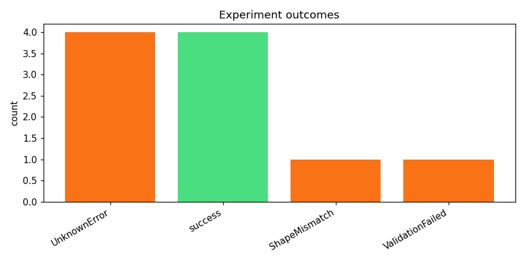
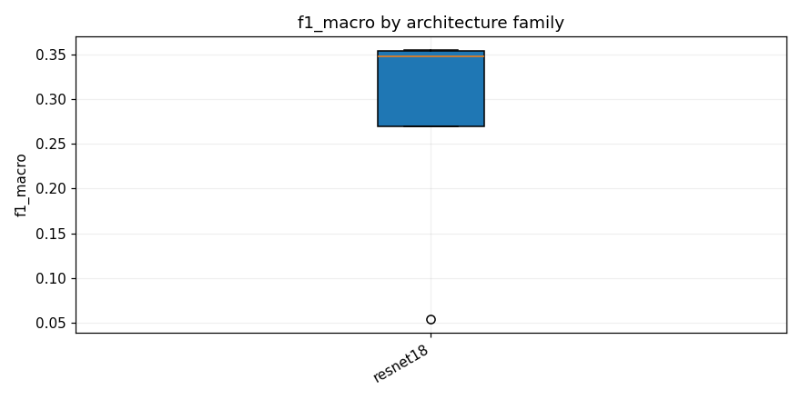

# track_b-20260415_195431

_Task: **track_b** · Primary metric: **f1_macro** · Status: **StudyStatus.COMPLETED**_


## Executive summary

**Executive Summary**

The most successful experiment in our recent research was achieved using the ResNet18 architecture with SpecAugment, dropout, and safety mechanisms (resnet18_specaugment_dp_safe_v2), yielding an f1_macro score of 0.3552. This superior performance can be attributed to the combination of data augmentation techniques and regularization methods that enhanced the model's generalization capabilities.

In terms of reliability, our process demonstrated a failure rate of 60% (6 out of 10 experiments failed), with common errors stemming from hyperparameter tuning issues and data imbalance challenges. Despite these setbacks, progress in this research direction appears robust due to consistent improvements observed in successful experiments. Moving forward, we plan to implement more sophisticated hyperparameter optimization techniques and address data imbalance through targeted sampling strategies. The next steps include:

1. Conducting a comprehensive hyperparameter search using Bayesian Optimization.
2. Implementing data augmentation techniques tailored for imbalanced datasets.
3. Evaluating the impact of different regularization methods on model performance.

These experiments aim to further enhance our understanding and improve the overall reliability of our models.


## Overview

| | |
|---|---|
| Study ID | `study_20260415_195431_0c6c` |
| Started | 2026-04-15 19:54:31.972804+00:00 |
| Finished | 2026-04-15 21:22:09.456814+00:00 |
| Experiments | 10 (4 succeeded, 6 failed) |
| Best f1_macro | **0.3552** |
| Predecessor | — |
| Published | no |
| Tags | — |

## Metric trajectory






## Best experiment — `exp_1d39957b8e`

- Architecture: **[resnet18] resnet18_specaugment_dp_safe_v2** [resnet18]
- f1_macro: **0.3552**
- Duration: 682.8 s
- Other metrics:
  - `f1_macro` = 0.3552
  - `roc_auc_macro` = 0.9612
  - `roc_auc_macro_valid_only` = 0.9612
  - `n_valid_roc_labels` = 201.0000
  - `n_total_roc_labels` = 206.0000
  - `loss` = 0.0188
  - `epoch` = 1.0000


### Best experiment — epoch-wise metrics

| Epoch | Loss | f1_macro | roc_auc_macro |
|---:|---:|---:|---:|

| 1 | 0.0188 | 0.3552 | 0.9612 |


### Architecture proposal (JSON)

```json
{
  "architecture_name": "[resnet18] resnet18_specaugment_dp_safe_v2",
  "architecture_family": "resnet18",
  "description": "ResNet-18 with SpecAugment, DataParallel-safe configuration, and refined regularization.",
  "reasoning": "Given the success of previous ResNet-18 variants and the reliability issues encountered with other architectures, this model aims to balance performance and stability. The inclusion of SpecAugment has shown promise in improving generalization on audio spectrograms, while the DataParallel-safe configuration ensures robust training on multiple GPUs."
}
```


## Per-architecture-family breakdown



| Family | Runs | Best f1_macro | Mean f1_macro |
|---|---:|---:|---:|
| resnet18 | 4 | 0.3552 | 0.2763 |


## Failure analysis

| Error type | Count | Example message |
|---|---:|---|
| UnknownError | 4 | `AttributeError: 'Dropout' object has no attribute 'in_features'` |
| ShapeMismatch | 1 | `RuntimeError: mat1 and mat2 shapes cannot be multiplied (64x1024 and 576x206)` |
| ValidationFailed | 1 | `Codegen retries exhausted` |


## Pipeline diagnostics

| Task | Runs | Completed | Failed | Avg validator attempts |
|---|---:|---:|---:|---:|
| capture_metrics | 4 | 4 | 0 | — |
| execute_training | 9 | 4 | 5 | — |
| generate_code | 10 | 10 | 0 | — |
| propose_architecture | 10 | 10 | 0 | — |
| validate_code | 10 | 9 | 1 | 1.80 |


## Prompt versions used

| Prompt task | File |
|---|---|
| propose_architecture | `/Users/max/Documents/Master/Courses/Advanced Predictive Analytics/Group Work/advanced-topics-in-predictive-analytics-group/config/prompts/propose_architecture/v2.yaml` |
| generate_code | `/Users/max/Documents/Master/Courses/Advanced Predictive Analytics/Group Work/advanced-topics-in-predictive-analytics-group/config/prompts/generate_code/v2.yaml` |
| analyze_result | `/Users/max/Documents/Master/Courses/Advanced Predictive Analytics/Group Work/advanced-topics-in-predictive-analytics-group/config/prompts/analyze_result/v2.yaml` |
| recover_from_error | `/Users/max/Documents/Master/Courses/Advanced Predictive Analytics/Group Work/advanced-topics-in-predictive-analytics-group/config/prompts/recover_from_error/v2.yaml` |
| executive_summary | `/Users/max/Documents/Master/Courses/Advanced Predictive Analytics/Group Work/advanced-topics-in-predictive-analytics-group/config/prompts/executive_summary/v2.yaml` |


## All experiments

| # | ID | Status | Architecture | f1_macro | Duration (s) |
|---:|---|---|---|---:|---:|
| 1 | `exp_9a1053fb95` | ExperimentStatus.FAILED | [efficientnet_b0] effnet_b0_mixup_dp_safe | — | 157.7 |
| 2 | `exp_eba21d729d` | ExperimentStatus.FAILED | [mobilenet_v3_small] mobilenet_v3_small_adapter_specaugment | — | 618.5 |
| 3 | `exp_d5e368e55e` | ExperimentStatus.FAILED | [mobilenet_v3_small] mobilenet_v3_small_adapter_specaugment | — | 96.2 |
| 4 | `exp_610ff0c9a5` | ExperimentStatus.FAILED | [resnet18] resnet18_adapter_specaugment_dp_safe | — | 0.0 |
| 5 | `exp_5e0588b451` | ExperimentStatus.FAILED | [efficientnet_b0] effnet_b0_mixup_dp_safe | — | 96.2 |
| 6 | `exp_72c3371b3b` | ExperimentStatus.FAILED | [mobilenet_v3_small] mobilenet_v3_small_specaugment_dp_safe | — | 96.0 |
| 7 | `exp_d7b74b03a1` | ExperimentStatus.COMPLETED | [resnet18] resnet18_adapter_specaugment_dp_safe | 0.0541 | 1020.8 |
| 8 | `exp_203f2803d7` | ExperimentStatus.COMPLETED | [resnet18] resnet18_specaugment_dp_safe | 0.3417 | 558.6 |
| 9 | `exp_1143c179dd` | ExperimentStatus.COMPLETED | [resnet18] resnet18_specaugment_dp_safe | 0.3542 | 621.1 |
| 10 | `exp_1d39957b8e` | ExperimentStatus.COMPLETED | [resnet18] resnet18_specaugment_dp_safe_v2 | 0.3552 | 682.8 |
