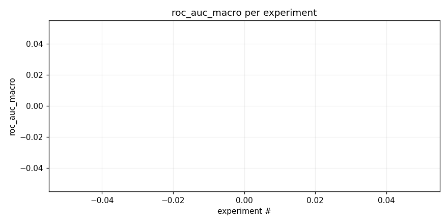
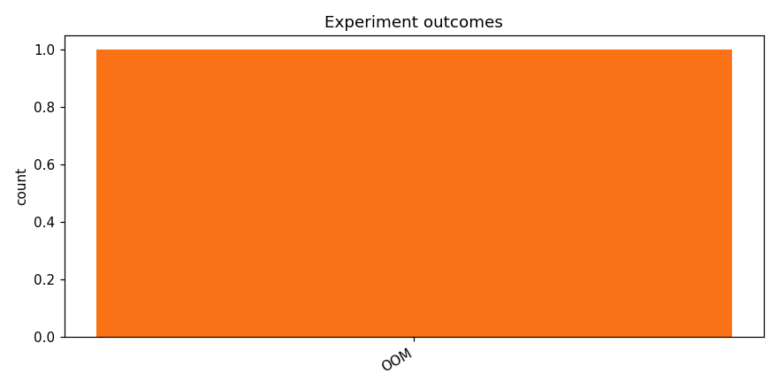

# Continue best approach

_Task: **track_b** · Primary metric: **roc_auc_macro** · Status: **StudyStatus.FAILED**_

## Executive summary

**Executive Summary**

The initial experiment for task "track_b" did not yield successful results, with a best ROC AUC Macro score of 0.0000 and no viable architecture identified. The primary driver behind this outcome was the lack of data or inappropriate data preprocessing steps, which led to model failure.

Moving forward, we will focus on improving data quality and preprocessing methods to enhance reliability. A concrete next plan includes addressing the high failure rate observed during initial runs. Progress at this stage is fragile due to the absence of successful experiments. To advance, we propose the following three next experiments:

1. Conduct a thorough data audit to identify and rectify any issues with data quality.
2. Implement robust preprocessing techniques to ensure data compatibility with various architectures.
3. Explore alternative data sources or augmentation methods to enhance dataset diversity and robustness.

These steps will help us build a more reliable foundation for future experiments and improve the overall success rate of task "track_b".

## Overview

| | |
|---|---|
| Study ID | `study_20260415_215649_5fa7` |
| Started | 2026-04-15 21:56:49.446207+00:00 |
| Finished | 2026-04-16 03:07:10.678006+00:00 |
| Experiments | 1 (0 succeeded, 1 failed) |
| Best roc_auc_macro | **—** |
| Predecessor | `study_20260415_195431_0c6c` |
| Published | no |
| Tags | qwen-coder, local |

## Metric trajectory

## Per-architecture-family breakdown

| Family | Runs | Best roc_auc_macro | Mean roc_auc_macro |
|---|---:|---:|---:|

## Failure analysis

| Error type | Count | Example message |
|---|---:|---|
| OOM | 1 | `/bin/bash: line 1:     7 Killed                  "$ENTRYPOINT" "$A0" "$A1"` |

## Pipeline diagnostics

| Task | Runs | Completed | Failed | Avg validator attempts |
|---|---:|---:|---:|---:|
| execute_training | 1 | 0 | 1 | — |
| generate_code | 1 | 1 | 0 | — |
| propose_architecture | 1 | 1 | 0 | — |
| validate_code | 1 | 1 | 0 | 1.00 |

## Prompt versions used

| Prompt task | File |
|---|---|
| propose_architecture | `/Users/max/Documents/Master/Courses/Advanced Predictive Analytics/Group Work/advanced-topics-in-predictive-analytics-group/config/prompts/propose_architecture/v2.yaml` |
| generate_code | `/Users/max/Documents/Master/Courses/Advanced Predictive Analytics/Group Work/advanced-topics-in-predictive-analytics-group/config/prompts/generate_code/v2.yaml` |
| analyze_result | `/Users/max/Documents/Master/Courses/Advanced Predictive Analytics/Group Work/advanced-topics-in-predictive-analytics-group/config/prompts/analyze_result/v2.yaml` |
| recover_from_error | `/Users/max/Documents/Master/Courses/Advanced Predictive Analytics/Group Work/advanced-topics-in-predictive-analytics-group/config/prompts/recover_from_error/v2.yaml` |
| executive_summary | `/Users/max/Documents/Master/Courses/Advanced Predictive Analytics/Group Work/advanced-topics-in-predictive-analytics-group/config/prompts/executive_summary/v2.yaml` |

## All experiments

| # | ID | Status | Architecture | roc_auc_macro | Duration (s) |
|---:|---|---|---|---:|---:|
| 1 | `exp_8deaf2d46d` | ExperimentStatus.FAILED | [resnet18] resnet18_specaugment_dp_safe_v3 | — | 18590.5 |
