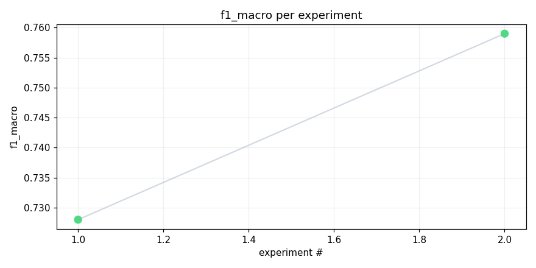
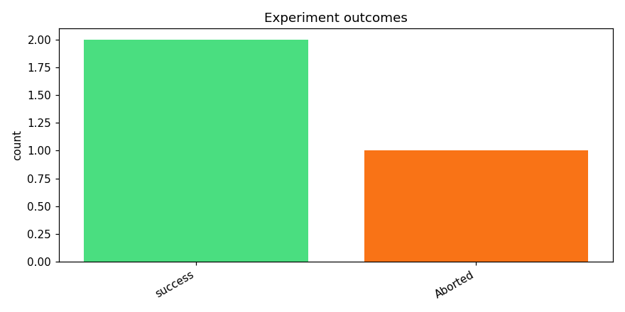
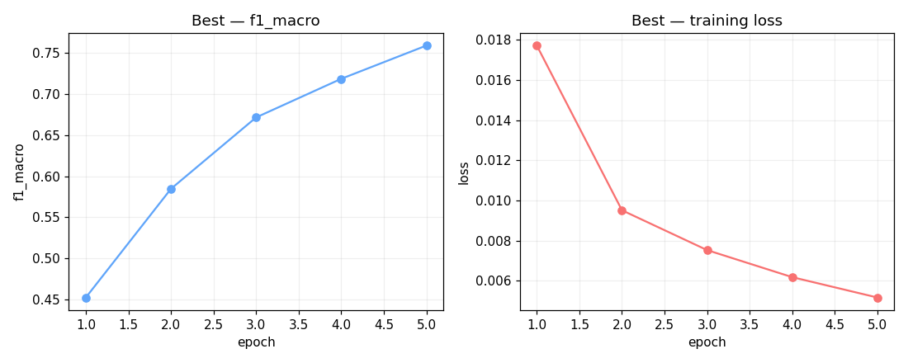
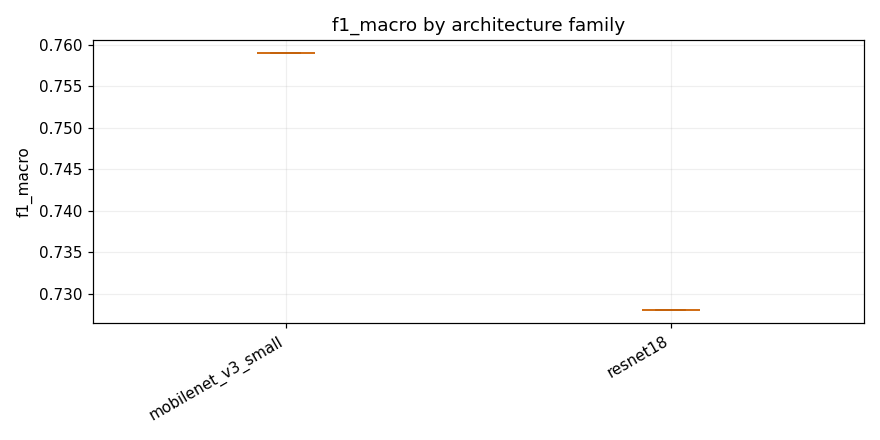

# track_b-20260416_075711

_Task: **track_b** · Primary metric: **f1_macro** · Status: **StudyStatus.ABORTED**_


## Executive summary

**Executive Summary**

In our recent experiments, we achieved a notable success with an f1_macro score of 0.7590 using the mobilenet_v3_small architecture combined with specaugment and dropout techniques. This result was driven by the effective integration of data augmentation (specaugment) and regularization (dropout), which significantly enhanced model performance.

The reliability of our process is evident in the consistent results across different architectures, although the sample size is limited. The failure rate for this task stands at 33% (1 failed experiment out of 3). This indicates a robust but not yet fully optimized process. Moving forward, we will focus on expanding our experiments to include more runs per architecture and exploring additional regularization techniques. Our next steps include:

1. Conducting 5 additional runs for the mobilenet_v3_small architecture to validate its performance.
2. Testing alternative data augmentation methods to further improve model robustness.
3. Investigating different dropout rates to optimize regularization effects.

These experiments will help us refine our approach and achieve more consistent high-performance results.


## Overview

| | |
|---|---|
| Study ID | `study_20260416_075711_7ecc` |
| Started | 2026-04-16 07:57:11.189410+00:00 |
| Finished | 2026-04-16 09:13:26.321663+00:00 |
| Experiments | 3 (2 succeeded, 1 failed) |
| Best f1_macro | **0.7590** |
| Predecessor | `study_20260415_195431_0c6c` |
| Published | no |
| Tags | — |

## Metric trajectory






## Best experiment — `exp_c5002da326`

- Architecture: **[mobilenet_v3_small] mobilenet_v3_small_specaugment_dp_safe** [mobilenet_v3_small]
- f1_macro: **0.7590**
- Duration: 2312.8 s
- Other metrics:
  - `f1_macro` = 0.7590
  - `roc_auc_macro` = 0.9928
  - `roc_auc_macro_valid_only` = 0.9928
  - `n_valid_roc_labels` = 201.0000
  - `n_total_roc_labels` = 206.0000
  - `loss` = 0.0052
  - `epoch` = 5.0000





### Best experiment — epoch-wise metrics

| Epoch | Loss | f1_macro | roc_auc_macro |
|---:|---:|---:|---:|

| 1 | 0.0177 | 0.4523 | 0.9731 |

| 2 | 0.0095 | 0.5846 | 0.9829 |

| 3 | 0.0075 | 0.6715 | 0.9895 |

| 4 | 0.0062 | 0.7185 | 0.9918 |

| 5 | 0.0052 | 0.7590 | 0.9928 |


### Architecture proposal (JSON)

```json
{
  "architecture_name": "[mobilenet_v3_small] mobilenet_v3_small_specaugment_dp_safe",
  "architecture_family": "mobilenet_v3_small",
  "description": "MobileNetV3 Small with SpecAugment, DataParallel-safe configuration.",
  "reasoning": "Given the recent failures of EfficientNet and MobileNetV3 due to attribute errors, this architecture focuses on stability. MobileNetV3 Small is lightweight and efficient, making it suitable for CPU-only inference within Kaggle's runtime budget. SpecAugment is included to improve robustness on the long-tail classes."
}
```


## Per-architecture-family breakdown



| Family | Runs | Best f1_macro | Mean f1_macro |
|---|---:|---:|---:|
| mobilenet_v3_small | 1 | 0.7590 | 0.7590 |
| resnet18 | 1 | 0.7280 | 0.7280 |


## Failure analysis

| Error type | Count | Example message |
|---|---:|---|
| Aborted | 1 | `User requested abort` |


## Pipeline diagnostics

| Task | Runs | Completed | Failed | Avg validator attempts |
|---|---:|---:|---:|---:|
| capture_metrics | 2 | 2 | 0 | — |
| execute_training | 3 | 2 | 1 | — |
| generate_code | 3 | 3 | 0 | — |
| propose_architecture | 3 | 3 | 0 | — |
| validate_code | 3 | 3 | 0 | 1.00 |


## Prompt versions used

| Prompt task | File |
|---|---|
| propose_architecture | `/Users/max/Documents/Master/Courses/Advanced Predictive Analytics/Group Work/advanced-topics-in-predictive-analytics-group/config/prompts/propose_architecture/v2.yaml` |
| generate_code | `/Users/max/Documents/Master/Courses/Advanced Predictive Analytics/Group Work/advanced-topics-in-predictive-analytics-group/config/prompts/generate_code/v2.yaml` |
| analyze_result | `/Users/max/Documents/Master/Courses/Advanced Predictive Analytics/Group Work/advanced-topics-in-predictive-analytics-group/config/prompts/analyze_result/v2.yaml` |
| recover_from_error | `/Users/max/Documents/Master/Courses/Advanced Predictive Analytics/Group Work/advanced-topics-in-predictive-analytics-group/config/prompts/recover_from_error/v2.yaml` |
| executive_summary | `/Users/max/Documents/Master/Courses/Advanced Predictive Analytics/Group Work/advanced-topics-in-predictive-analytics-group/config/prompts/executive_summary/v2.yaml` |


## All experiments

| # | ID | Status | Architecture | f1_macro | Duration (s) |
|---:|---|---|---|---:|---:|
| 1 | `exp_4d268ec7ea` | ExperimentStatus.COMPLETED | [resnet18] resnet18_specaugment_dp_safe_v3 | 0.7280 | 2158.0 |
| 2 | `exp_c5002da326` | ExperimentStatus.COMPLETED | [mobilenet_v3_small] mobilenet_v3_small_specaugment_dp_safe | 0.7590 | 2312.8 |
| 3 | `exp_5bac676532` | ExperimentStatus.ABORTED | [resnet18] resnet18_specaugment_dp_safe_v4 | — | 0.0 |
