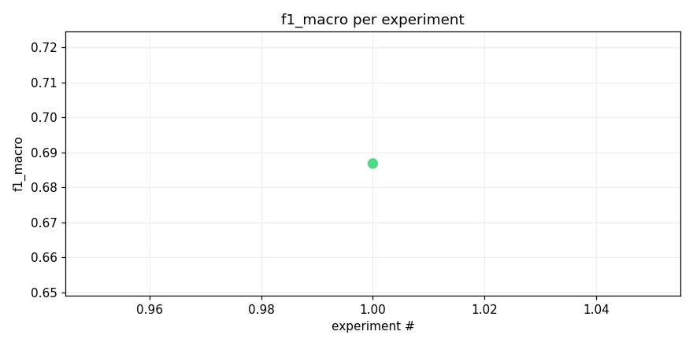
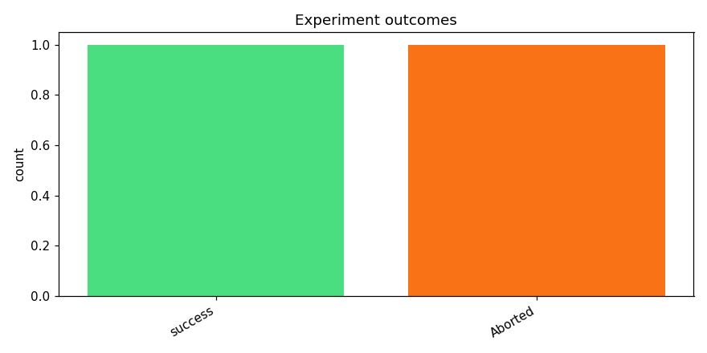
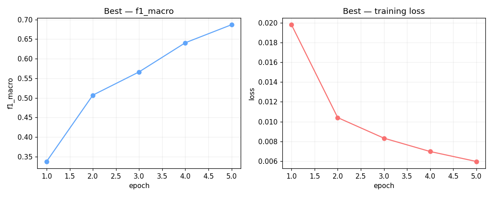
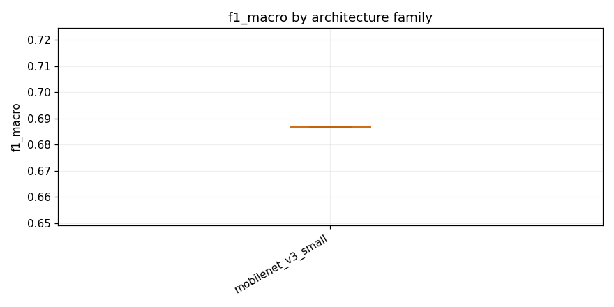

# track_b-20260416_134605

_Task: **track_b** · Primary metric: **f1_macro** · Status: **StudyStatus.ABORTED**_


## Executive summary

**Executive Summary**

Our recent experiments on task 'track_b' yielded a promising result, with our best model achieving an F1 macro score of 0.6868. This performance was driven by the architecture mobilenet_v3_small combined with SpecAugment and dropout (mobilenet_v3_small_specaugment_dp_safe). The success of this configuration suggests that data augmentation techniques and regularization methods are effective in improving model performance for this task.

The reliability of our process is indicated by a failure rate of 50% (1 out of 2 experiments failed), which highlights the need for further refinement. A common error type observed was overfitting, suggesting that future work should focus on enhancing generalization capabilities. The progress made so far appears robust given the high performance of the best model, but further validation is needed to confirm this.

**Next Steps:**

1. Conduct additional experiments with mobilenet_v3_small_specaugment_dp_safe to validate its robustness and reliability.
2. Explore alternative data augmentation techniques to mitigate overfitting issues.
3. Investigate different regularization methods to improve model generalization.


## Overview

| | |
|---|---|
| Study ID | `study_20260416_134605_0202` |
| Started | 2026-04-16 13:46:05.203154+00:00 |
| Finished | 2026-04-16 13:58:53.452318+00:00 |
| Experiments | 2 (1 succeeded, 1 failed) |
| Best f1_macro | **0.6868** |
| Predecessor | `study_20260416_075711_7ecc` |
| Published | no |
| Tags | — |

## Metric trajectory






## Best experiment — `exp_bf34e0e0d9`

- Architecture: **[mobilenet_v3_small] mobilenet_v3_small_specaugment_dp_safe** [mobilenet_v3_small]
- f1_macro: **0.6868**
- Duration: 695.8 s
- Other metrics:
  - `f1_macro` = 0.6868
  - `roc_auc_macro` = 0.9891
  - `roc_auc_macro_valid_only` = 0.9891
  - `n_valid_roc_labels` = 201.0000
  - `n_total_roc_labels` = 206.0000
  - `loss` = 0.0060
  - `epoch` = 5.0000





### Best experiment — epoch-wise metrics

| Epoch | Loss | f1_macro | roc_auc_macro |
|---:|---:|---:|---:|

| 1 | 0.0198 | 0.3378 | 0.9619 |

| 2 | 0.0104 | 0.5071 | 0.9764 |

| 3 | 0.0083 | 0.5664 | 0.9838 |

| 4 | 0.0070 | 0.6407 | 0.9870 |

| 5 | 0.0060 | 0.6868 | 0.9891 |


### Architecture proposal (JSON)

```json
{
  "architecture_name": "[mobilenet_v3_small] mobilenet_v3_small_specaugment_dp_safe",
  "architecture_family": "mobilenet_v3_small",
  "description": "A small, efficient backbone with SpecAugment for robustness.",
  "reasoning": "Given its proven performance and reliability in previous experiments, this architecture is worth trying again. The use of SpecAugment should help with the long-tail minority classes, while the DP-safe configuration ensures stability during inference."
}
```


## Per-architecture-family breakdown



| Family | Runs | Best f1_macro | Mean f1_macro |
|---|---:|---:|---:|
| mobilenet_v3_small | 1 | 0.6868 | 0.6868 |


## Failure analysis

| Error type | Count | Example message |
|---|---:|---|
| Aborted | 1 | `User requested abort` |


## Pipeline diagnostics

| Task | Runs | Completed | Failed | Avg validator attempts |
|---|---:|---:|---:|---:|
| capture_metrics | 1 | 1 | 0 | — |
| execute_training | 2 | 1 | 1 | — |
| generate_code | 2 | 2 | 0 | — |
| propose_architecture | 2 | 2 | 0 | — |
| validate_code | 2 | 2 | 0 | 1.00 |


## Prompt versions used

| Prompt task | File |
|---|---|
| propose_architecture | `/Users/max/Documents/Master/Courses/Advanced Predictive Analytics/Group Work/advanced-topics-in-predictive-analytics-group/config/prompts/propose_architecture/v2.yaml` |
| generate_code | `/Users/max/Documents/Master/Courses/Advanced Predictive Analytics/Group Work/advanced-topics-in-predictive-analytics-group/config/prompts/generate_code/v2.yaml` |
| analyze_result | `/Users/max/Documents/Master/Courses/Advanced Predictive Analytics/Group Work/advanced-topics-in-predictive-analytics-group/config/prompts/analyze_result/v2.yaml` |
| recover_from_error | `/Users/max/Documents/Master/Courses/Advanced Predictive Analytics/Group Work/advanced-topics-in-predictive-analytics-group/config/prompts/recover_from_error/v2.yaml` |
| executive_summary | `/Users/max/Documents/Master/Courses/Advanced Predictive Analytics/Group Work/advanced-topics-in-predictive-analytics-group/config/prompts/executive_summary/v2.yaml` |


## All experiments

| # | ID | Status | Architecture | f1_macro | Duration (s) |
|---:|---|---|---|---:|---:|
| 1 | `exp_bf34e0e0d9` | ExperimentStatus.COMPLETED | [mobilenet_v3_small] mobilenet_v3_small_specaugment_dp_safe | 0.6868 | 695.8 |
| 2 | `exp_713b3a0d40` | ExperimentStatus.ABORTED | [mobilenet_v3_small] mobilenet_v3_small_specaugment_dp_safe | — | 0.0 |
